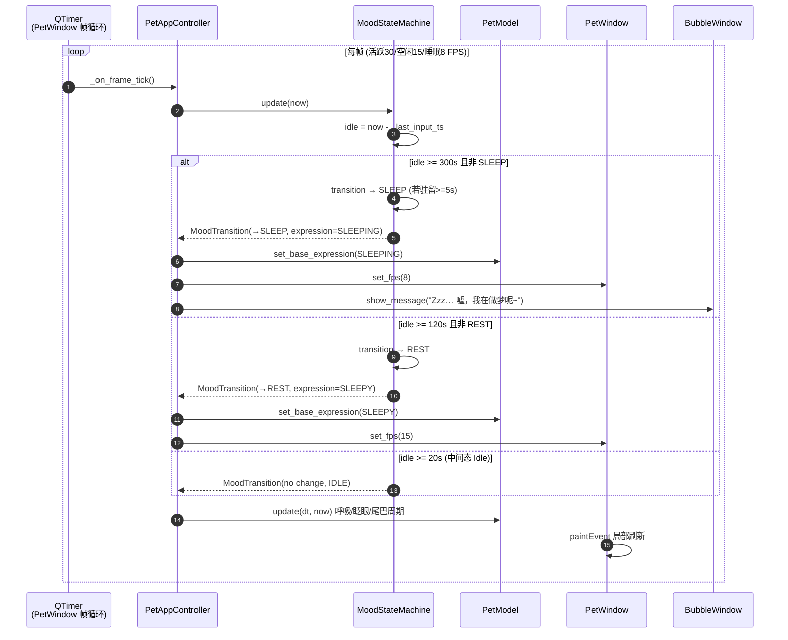
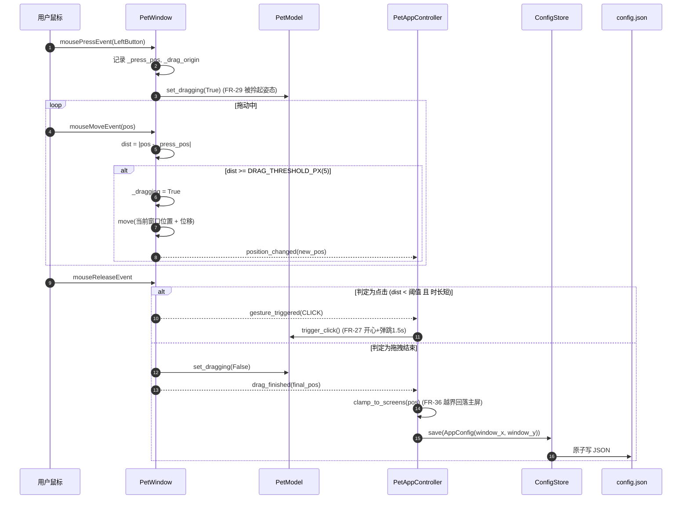

# desktop-pet 系统架构设计 + 任务分解

> 版本：v1.0　|　角色：架构师（高见远）　|　上游输入：`docs/prd.md`（39 条需求）
> 目标平台：Windows (win32)　|　技术栈（已锁定）：Python 3.13 + PySide6 + pynput
> 宠物形象：程序化矢量绘制（QPainter 参数化猫咪），**零外部图片素材**

---

## 0. 需求追溯矩阵（FR → 模块/文件）

| FR | 需求摘要 | 优先级 | 负责模块 / 文件 |
| --- | --- | --- | --- |
| FR-01 | 全局键盘敲击检测（失焦生效） | P0 | `app/keyboard_listener.py`（pynput 守护线程 + 信号桥） |
| FR-02 | 敲键同步"敲键盘"动画，延迟 < 100ms | P0 | `app/controller.py` + `core/pet_model.py`(`press_arm`) + `ui/pet_renderer.py` |
| FR-03 | 高频敲击判定（300ms ≥ 3 次） | P0 | `core/event_aggregator.py` |
| FR-04 | 敲击动画与表情联动（专注/兴奋） | P1 | `core/mood_state_machine.py` + `core/pet_model.py` |
| FR-05 | 四态情绪状态机 | P0 | `core/mood_state_machine.py` |
| FR-06 | 空闲态（20s~120s） | P0 | `core/mood_state_machine.py` + `core/constants.py` |
| FR-07 | 专注态 | P0 | `core/mood_state_machine.py` + `core/event_aggregator.py` |
| FR-08 | 休息/摸鱼态（≥120s） | P0 | `core/mood_state_machine.py` |
| FR-09 | 睡觉态（≥300s）+ 唤醒 | P0 | `core/mood_state_machine.py` + `core/pet_model.py` |
| FR-10 | 敲键即时反馈最高优先级 | P0 | `core/pet_model.py`（表达插队/打断）+ `app/controller.py` |
| FR-11 | ≥8 种表情，部件独立驱动 | P0 | `core/constants.py`(Expression) + `core/pet_model.py` + `ui/pet_renderer.py` |
| FR-12 | 表情触发条件明确，100ms 内可见 | P0 | `core/mood_state_machine.py` + `app/controller.py` |
| FR-13 | 尾巴/耳朵待机微动 | P1 | `core/motion.py`（周期函数）+ `core/pet_model.py` |
| FR-14 | 眨眼/呼吸生命体征 | P0 | `core/motion.py` + `core/pet_model.py` |
| FR-15 | 无边框 + 背景透明 | P0 | `ui/pet_window.py`（FramelessWindowHint + WA_TranslucentBackground） |
| FR-16 | 始终置顶 | P0 | `ui/pet_window.py`（WindowStaysOnTopHint） |
| FR-17 | 常驻桌面 + 不占任务栏 | P0 | `ui/pet_window.py`（Qt.Tool） |
| FR-18 | 鼠标拖动摆放位置 | P0 | `ui/pet_window.py`（mousePress/Move/Release） |
| FR-19 | 右键菜单 | P1 | `ui/pet_window.py`（contextMenuEvent）+ `ui/tray.py`（复用菜单） |
| FR-20 | 缩放 80/100/120%，立即生效并记忆 | P1 | `ui/pet_window.py`(set_scale) + `core/config.py` |
| FR-21 | 多显示器适配 | P2 | `core/motion.py`(clamp_to_screens) + `ui/pet_window.py` |
| FR-22 | 最小化到托盘 | P0 | `ui/tray.py` + `app/controller.py` |
| FR-23 | 从托盘恢复 | P0 | `ui/tray.py` + `app/controller.py` |
| FR-24 | 托盘退出（无残留线程） | P0 | `app/controller.py`(shutdown) + `app/keyboard_listener.py`(stop) |
| FR-25 | 托盘图标样式（猫脸剪影） | P1 | `ui/pet_renderer.py`(build_tray_icon) + `ui/tray.py` |
| FR-26 | 开机自启（winreg，免管理员） | P2 | `app/controller.py`(autostart) |
| FR-27 | 点击 → 开心 + 弹跳 1.5s | P1 | `ui/pet_window.py`(点击判定) + `core/pet_model.py`(trigger_click) |
| FR-28 | 悬停 ≥1s → 开心/眯眼 | P1 | `ui/pet_window.py`(enter/leaveEvent) + `core/pet_model.py`(set_hover) |
| FR-29 | 拖拽 → 被拎起姿态 | P1 | `ui/pet_window.py`(drag) + `core/pet_model.py`(set_dragging) |
| FR-30 | 气泡对话提示，2~4s 淡出，不遮挡托盘 | P1 | `ui/bubble.py` + `core/constants.py`(文案表) |
| FR-31 | 内存 < 120MB | P0 | 全局（见 §6 性能分析） |
| FR-32 | 空闲 CPU < 2% | P0 | 全局（见 §6 性能分析） |
| FR-33 | 活跃 CPU < 10% | P1 | `ui/pet_window.py`（按需重绘/脏区域刷新） |
| FR-34 | 30 FPS 活跃 / 15 FPS 空闲 | P0 | `ui/pet_window.py`(帧率切换) + `core/constants.py` |
| FR-35 | 空闲休眠优化（脏区域局部刷新） | P1 | `ui/pet_window.py`（update(rect) + 帧率降频） |
| FR-36 | 窗口位置持久化（越界回落主屏） | P0 | `core/config.py` + `app/controller.py` |
| FR-37 | 缩放档位持久化 | P1 | `core/config.py` |
| FR-38 | 开关项持久化 | P0 | `core/config.py` |
| FR-39 | JSON 配置 + 损坏回落默认 | P0 | `core/config.py` |

---

## 1. 实现方案总览（分层架构）

### 1.1 三层架构与依赖方向

```
┌───────────────────────────────────────────────────────────────┐
│  app 组装层（允许 import QtCore / QtGui / QtWidgets / pynput）  │
│  keyboard_listener.py (pynput→Signal 桥)   controller.py (装配) │
│  依赖方向：app ──▶ ui ──▶ core        （单向，绝无反向）          │
└───────────────▲───────────────────────────────▲────────────────┘
                │                               │
┌───────────────┴──────────────┐ ┌──────────────┴────────────────┐
│  ui 渲染层 (QtGui/QtWidgets)  │ │  core 纯逻辑层 (零 Qt 依赖)    │
│  pet_renderer.py  pet_window  │ │  constants config event_agg     │
│  bubble.py        tray.py     │ │  mood_state_machine motion      │
│  只做"把 PetPose 画出来"+ 事件 │ │  pet_model                      │
│  采集，不含业务判定逻辑        │ │  ★ 可被 pytest 无头单测 ★       │
└───────────────────────────────┘ └────────────────────────────────┘
```

### 1.2 分层边界（硬性约束）

| 层 | 允许的 import | 禁止的 import | 理由 |
| --- | --- | --- | --- |
| `core/` | 仅标准库（`enum/dataclasses/json/pathlib/math/time/typing/logging`） | **任何 `PySide6.*`** | 纯逻辑可无头单测（硬性架构要求） |
| `ui/` | `PySide6.QtCore/QtGui/QtWidgets` + `core.*` | 不得直接引用 `app.*`；不得含状态机判定逻辑 | 渲染与交互采集；避免循环依赖 |
| `app/` | `PySide6.QtCore` + `pynput` + `ui.*` + `core.*` | — | 组装、跨线程桥、系统集成 |

**依赖方向单向**：`app → ui → core`。`core` 不认识 `ui`，`ui` 不认识 `app`。
**唯一跨线程点**：`app/keyboard_listener.py` 的 `KeystrokeBridge(QObject)` 通过 **Qt 信号** 把 pynput 线程事件投递给主线程（自动 `QueuedConnection`）。

### 1.3 关键架构决策（对应 PRD 硬要求）

| 决策点 | 方案 | 对应需求 |
| --- | --- | --- |
| 键盘线程安全 | pynput `Listener` 独立守护线程 → `KeystrokeBridge.keystroke = Signal(float)` → 主线程 slot。**工作线程绝不触碰任何 QWidget** | FR-01 |
| 可测试性 | 状态机 / 事件聚合 / 几何插值 / 配置 四块全部落在 `core/`，纯 Python、可注入 `now`(float) 时钟，pytest 无需 QApplication | 硬性要求 |
| 渲染 | `QPainter` 参数化绘制，`PetPose` 数据驱动；`paintEvent` 用 `update(rect)` 只刷脏区 | FR-11/34/35 |
| 帧率策略 | 活跃 30 FPS / 空闲 15 FPS / 睡眠 8 FPS，定时器 interval 动态切换 | FR-34 |
| 状态机防抖 | 最小驻留 `MIN_DWELL_S = 5s` | PRD §5 |
| 手势区分 | 拖动阈值 `DRAG_THRESHOLD_PX = 5`，位移小于阈值且短时 → 点击；≥1s 悬停 → 抚摸 | FR-18/27/28/29 |
| 配置容错 | JSON 读取异常/字段缺失 → 逐字段回落默认值，绝不崩溃 | FR-39 |

---

## 2. 框架选型说明

| 选型 | 版本 | 理由 | 风险与缓解 |
| --- | --- | --- | --- |
| **PySide6** | `>=6.8,<6.10` | ① 官方 LGPL，商用友好；② `QPainter` 矢量绘制/抗锯齿/透明窗口能力成熟；③ `QSystemTrayIcon`、`QTimer`、跨线程信号/槽开箱即用；④ 6.8 起正式支持 Python 3.13 | 基线内存偏高（见 §6）；缓解：仅 import 必需子模块、避免 QWebEngine/大图缓存 |
| **pynput** | `>=1.7.7` | Windows 下全局键盘钩子的成熟方案，纯 Python、无需管理员权限，`Listener` 自带线程 | ① 回调在工作线程 → 必须经信号桥；② 监听线程异常需捕获并记录，不崩溃（FR-01） |
| **标准库 `winreg`** | stdlib | 写 `HKCU\...\Run` 实现开机自启，免管理员 | 仅 Windows；用 `sys.platform` 守卫 |
| 绘图方案 | 不引入 PIL/图片 | 满足"零外部素材"，全部 `QPainter` 矢量 | 需精心设计参数化几何（见 `core/motion.py` + `ui/pet_renderer.py`） |

> **不选**：Tkinter（透明/置顶/抗锯齿能力弱）、Electron（内存远超 120MB 目标）、PyQt6（GPL 许可风险）。

---

## 3. 文件列表及相对路径

> **源文件总数 = 13 个实质模块**（另含 4 个仅数行的 `__init__.py` 包标记，不计入 14 个预算）。
> 代码根：`src/desktop_pet/`。

| 文件路径 | 职责 | 关键类 / 函数 | 预估行数 |
| --- | --- | --- | --- |
| `src/desktop_pet/__init__.py` | 包标记 + 版本号 | `__version__` | 3 |
| `src/desktop_pet/main.py` | 程序入口，创建 QApplication、装配 Controller | `main() -> int` | 60 |
| `src/desktop_pet/core/__init__.py` | 包标记 | — | 2 |
| `src/desktop_pet/core/constants.py` | 全部枚举 + 时间/配色/尺寸/文案常量 | `Mood` `Expression` `Gesture`；常量集合 | 150 |
| `src/desktop_pet/core/config.py` | 配置 dataclass + JSON 读写 + 容错 | `AppConfig` `ConfigStore` | 130 |
| `src/desktop_pet/core/event_aggregator.py` | 敲击计数、高频判定（300ms/3 次） | `KeystrokeAggregator` `KeystrokeResult` | 90 |
| `src/desktop_pet/core/mood_state_machine.py` | 四态状态机 + 最小驻留防抖 | `MoodStateMachine` `MoodTransition` | 190 |
| `src/desktop_pet/core/motion.py` | 缓动函数、插值、周期动画、屏幕越界钳制 | `lerp` `clamp` `ease_*` `interpolate_pose` `breath_offset` `tail_angle` `clamp_to_screens` | 170 |
| `src/desktop_pet/core/pet_model.py` | 猫咪参数模型：表情→姿态模板、插值推进、临时动作插队 | `PetPose` `PetModel` | 230 |
| `src/desktop_pet/ui/__init__.py` | 包标记 | — | 2 |
| `src/desktop_pet/ui/pet_renderer.py` | QPainter 矢量渲染器 + 托盘图标生成 | `PetRenderer` | 300 |
| `src/desktop_pet/ui/pet_window.py` | 无边框透明置顶窗口、拖拽、鼠标手势、动画循环 | `PetWindow` | 240 |
| `src/desktop_pet/ui/bubble.py` | 气泡浮层窗口（淡入淡出 + 顶部翻转避让） | `BubbleWindow` | 140 |
| `src/desktop_pet/ui/tray.py` | 系统托盘 + 右键菜单 + 信号 | `TrayController` | 130 |
| `src/desktop_pet/app/__init__.py` | 包标记 | — | 2 |
| `src/desktop_pet/app/keyboard_listener.py` | pynput 守护线程 + Qt 信号桥 | `KeystrokeBridge` `KeyboardListener` | 100 |
| `src/desktop_pet/app/controller.py` | 装配所有模块、业务接线、自启、生命周期 | `PetAppController` | 220 |

---

## 4. 数据结构与接口（类图）

```mermaid
classDiagram
    direction LR

    %% ===================== core 纯逻辑层 =====================
    class Mood {
        <<enumeration>>
        IDLE
        FOCUS
        REST
        SLEEP
    }
    class Expression {
        <<enumeration>>
        HAPPY
        FOCUS
        SLEEPY
        SURPRISED
        SULKY
        YAWN
        SLEEPING
        EXCITED
    }
    class Gesture {
        <<enumeration>>
        NONE
        CLICK
        HOVER
        DRAG
        WAKE
    }

    class AppConfig {
        +int version
        +int window_x
        +int window_y
        +float scale
        +bool listen_enabled
        +bool bubble_enabled
        +bool autostart
        +to_dict() dict
        +from_dict(data: dict) AppConfig
    }

    class ConfigStore {
        -Path path
        +__init__(path: Path)
        +static default_path() Path
        +load() AppConfig
        +save(cfg: AppConfig) None
        -_read_raw() dict
    }

    class KeystrokeResult {
        +int burst_count
        +bool high_frequency
        +float rate_per_sec
    }

    class KeystrokeAggregator {
        -float window_ms
        -int threshold
        -Deque~float~ _timestamps
        -bool _high_freq
        +__init__(window_ms: float, threshold: int)
        +record(timestamp: float) KeystrokeResult
        +is_high_frequency() bool
        +reset() None
    }

    class MoodTransition {
        +Mood from_mood
        +Mood to_mood
        +Expression expression
        +str reason
        +float timestamp
        +bool changed
    }

    class MoodStateMachine {
        -Mood _state
        -float _state_since
        -float _last_input_ts
        -float _idle_start_s
        -float _rest_s
        -float _sleep_s
        -float _min_dwell_s
        +__init__(idle_start_s: float, rest_s: float, sleep_s: float, min_dwell_s: float)
        +update(now: float) MoodTransition
        +on_keystroke(now: float, high_frequency: bool) MoodTransition
        +on_wake(now: float) MoodTransition
        +on_gesture(gesture: Gesture, now: float) MoodTransition
        +idle_seconds(now: float) float
        +state_since() float
        +force(mood: Mood, now: float) None
        -_can_transition(now: float) bool
        -_set_state(mood: Mood, now: float, reason: str) MoodTransition
    }

    class PetPose {
        +float body_y
        +float body_squash
        +float head_y
        +float head_tilt
        +float look_x
        +float look_y
        +float eye_open_l
        +float eye_open_r
        +float eye_curve
        +float pupil_dilate
        +float mouth_curve
        +float mouth_open
        +float tongue_show
        +float ear_l_angle
        +float ear_r_angle
        +float ear_l_tilt
        +float ear_r_tilt
        +float arm_l_press
        +float arm_r_press
        +float arm_dangle
        +float tail_angle
        +float tail_curve
        +float blush_alpha
        +float glow_alpha
        +float tear_alpha
        +float zzz_alpha
        +lerp_to(other: PetPose, t: float) PetPose
    }

    class PetModel {
        -PetPose _current
        -PetPose _target
        -float _blink_timer
        -float _breath_phase
        -float _tail_phase
        -float _press_timer
        -int _press_arm
        -bool _dragging
        -bool _hovering
        -Expression _base_expression
        +__init__()
        +set_expression(expr: Expression, duration: float) None
        +set_base_expression(expr: Expression) None
        +trigger_click() None
        +set_dragging(active: bool) None
        +set_hover(active: bool) None
        +press_arm() None
        +update(dt: float, now: float) None
        +pose() PetPose
        +static pose_for_expression(expr: Expression) PetPose
    }

    %% ===================== ui 渲染层 =====================
    class PetRenderer {
        +__init__()
        +paint(painter: QPainter, pose: PetPose, scale: float, size: QSize) None
        +static build_tray_icon() QIcon
        -_draw_glow(painter: QPainter, pose: PetPose)
        -_draw_tail(painter: QPainter, pose: PetPose)
        -_draw_body(painter: QPainter, pose: PetPose)
        -_draw_arms(painter: QPainter, pose: PetPose)
        -_draw_head(painter: QPainter, pose: PetPose)
        -_draw_face(painter: QPainter, pose: PetPose)
        -_draw_zzz(painter: QPainter, pose: PetPose)
    }

    class PetWindow {
        +Signal position_changed
        +Signal gesture_triggered
        +Signal drag_finished
        -PetModel _model
        -PetRenderer _renderer
        -QTimer _timer
        -float _scale
        -QPoint _drag_origin
        -bool _dragging
        +__init__(model: PetModel, renderer: PetRenderer, scale: float)
        +set_scale(scale: float) None
        +set_fps(fps: int) None
        +restore_position(x: int, y: int) None
        +paintEvent(event: QPaintEvent) None
        +mousePressEvent(event: QMouseEvent) None
        +mouseMoveEvent(event: QMouseEvent) None
        +mouseReleaseEvent(event: QMouseEvent) None
        +enterEvent(event: QEnterEvent) None
        +leaveEvent(event: QEvent) None
        +contextMenuEvent(event: QContextMenuEvent) None
        -_on_frame() None
    }

    class BubbleWindow {
        -str _text
        -float _alpha
        -int _phase
        -QTimer _timer
        +__init__()
        +show_message(text: str, duration: float) None
        +paintEvent(event: QPaintEvent) None
        -_update_alpha() None
        -_compute_geometry(anchor: QPoint) QRect
    }

    class TrayController {
        +Signal listen_toggled
        +Signal scale_selected
        +Signal minimize_requested
        +Signal restore_requested
        +Signal autostart_toggled
        +Signal quit_requested
        -QSystemTrayIcon _tray
        -QMenu _menu
        -QIcon _icon
        +__init__(icon: QIcon, cfg: AppConfig)
        +show() None
        +notify(title: str, msg: str) None
        +set_listen_checked(checked: bool) None
        +set_scale_checked(scale: float) None
        -_build_menu() None
    }

    %% ===================== app 组装层 =====================
    class KeystrokeBridge {
        +Signal keystroke
        +__init__()
        +emit_keystroke(timestamp: float) None
    }

    class KeyboardListener {
        -KeystrokeBridge _bridge
        -Any _listener
        -bool _running
        +__init__(bridge: KeystrokeBridge)
        +start() None
        +stop() None
        +is_running() bool
        -_on_press(key: Any) None
    }

    class PetAppController {
        -QApplication _app
        -ConfigStore _store
        -AppConfig _cfg
        -PetModel _model
        -PetRenderer _renderer
        -PetWindow _window
        -BubbleWindow _bubble
        -TrayController _tray
        -KeyboardListener _keyboard
        -KeystrokeBridge _bridge
        -KeystrokeAggregator _aggregator
        -MoodStateMachine _sm
        +__init__(app: QApplication, store: ConfigStore)
        +start() None
        +shutdown() None
        -_on_keystroke(timestamp: float) None
        -_on_frame_tick() None
        -_on_gesture(gesture: int) None
        -_sync_fps_and_visuals(transition: MoodTransition) None
        -_show_bubble_for(expr: Expression) None
        -_apply_scale(scale: float) None
        -_persist() None
        -_set_autostart(enabled: bool) None
    }

    %% ===================== 关系 =====================
    ConfigStore ..> AppConfig : creates
    KeystrokeAggregator ..> KeystrokeResult : creates
    MoodStateMachine ..> MoodTransition : creates
    PetModel ..> PetPose : owns
    PetModel ..> Expression : uses
    MoodStateMachine ..> Mood : uses
    MoodStateMachine ..> Expression : maps
    MoodStateMachine ..> Gesture : uses
    PetWindow --> PetModel : drives
    PetWindow --> PetRenderer : uses
    BubbleWindow ..> Expression : shows text for
    TrayController ..> AppConfig : reads
    KeyboardListener --> KeystrokeBridge : emits via
    PetAppController --> ConfigStore : uses
    PetAppController --> PetModel : owns
    PetAppController --> PetWindow : owns
    PetAppController --> BubbleWindow : owns
    PetAppController --> TrayController : owns
    PetAppController --> KeyboardListener : owns
    PetAppController --> KeystrokeAggregator : owns
    PetAppController --> MoodStateMachine : owns
```



---

## 5. 程序调用流程（时序图）

### 5.1 (a) 一次按键 → 跨线程信号 → 节流判定 → 状态机更新 → 触发重绘 → 帧渲染

```mermaid
sequenceDiagram
    autonumber
    participant KB as 系统键盘
    participant PL as pynput Listener<br/>(工作线程)
    participant BR as KeystrokeBridge
    participant CT as PetAppController<br/>(主线程 slot)
    participant AG as KeystrokeAggregator
    participant SM as MoodStateMachine
    participant MD as PetModel
    participant WN as PetWindow
    participant RD as PetRenderer

    KB->>PL: key press (任意前台窗口)
    PL->>PL: _on_press(key) 取 time.monotonic()
    PL->>BR: emit_keystroke(ts)
    Note over BR,CT: Qt 信号跨线程 → 自动 QueuedConnection
    BR-->>CT: keystroke(ts) 队列投递到主线程
    CT->>AG: record(ts)
    AG->>AG: 剔除窗口外时间戳, 计数 burst_count
    AG-->>CT: KeystrokeResult(burst_count, high_frequency)
    CT->>SM: on_keystroke(ts, high_frequency)
    SM->>SM: 重置无输入计时器; 若 high_frequency → FOCUS
    SM-->>CT: MoodTransition(from, to, expression, reason)
    CT->>MD: press_arm()  (FR-02 敲击动画, 优先打断)
    CT->>MD: set_expression(expr, duration)
    CT->>WN: set_fps(30)
    CT->>WN: update()  触发脏区重绘
    WN->>MD: update(dt, now)  推进姿态插值
    WN->>RD: paint(painter, pose, scale, size)
    RD-->>WN: 已绘制的猫（爪子按压帧）
    Note over KB,RD: 端到端延迟目标 < 100ms (FR-02)
```

### 5.2 (b) 无输入计时推进 → Idle → Rest → Sleep 状态迁移



### 5.3 (c) 鼠标拖拽 → 窗口移动 → 松手持久化



---

## 6. 性能与资源分析（FR-31/32/33/34/35）

### 6.1 PySide6 基线内存分析（量化判断）

| 组成 | 典型 RSS 增量（Windows / Python 3.13 / PySide6 6.8） |
| --- | --- |
| Python 3.13 解释器 + 标准库 | ~15–20 MB |
| `QtCore` | ~10 MB |
| `QtGui`（字体/绘制引擎/图标） | ~25–35 MB |
| `QtWidgets`（窗口系统） | ~20–30 MB |
| 本程序对象（PetModel/Pose/Renderer/QPixmap 小缓存） | ~5–10 MB |
| **合计估算** | **约 80–110 MB** |

**结论**：120MB 目标**可达但偏紧**，基线（含 Qt 库）已占约 80–110MB，留给业务对象的安全余量约 10–40MB。

**优化与验收建议（工程师必须遵守）**：
1. **禁止引入 QWebEngine / QtCharts / QtMultimedia** 等重型模块；只 import `QtCore/QtGui/QtWidgets`。
2. `PetRenderer` 不做大图缓存、不生成 QPixmap 位图宠物，全部即时矢量绘制（矢量绘制 CPU 略高但内存恒定）。
3. 托盘图标用 `QPixmap` 生成后即交给 `QIcon`，不长期持有额外副本；气泡关闭后释放其窗口对象（复用单个 `BubbleWindow` 实例）。
4. **在 T03 结束时用任务管理器实测 RSS 作为门禁**：若 > 110MB，优先核查是否有隐藏的 Qt 模块被间接加载；如仍超 120MB，提交"实测数据 + 偏差说明"给 team-lead，不隐瞒。

### 6.2 CPU 与帧率（FR-32/33/34/35）

| 场景 | 帧率 | 定时器 interval | 重绘策略 | CPU 目标 |
| --- | --- | --- | --- | --- |
| 活跃（敲击/专注/兴奋） | 30 FPS | 33 ms | `update()` 全窗口（宠物本体） | < 10%（FR-33） |
| 空闲/休息 | 15 FPS | 66 ms | `update(pet_rect)` 脏区局部刷新 | < 2%（FR-32） |
| 睡觉 | 8 FPS | 125 ms | 仅呼吸起伏区域 `update(rect)` | 进一步省电（FR-35） |

**脏区域刷新（FR-35）做法**：`PetWindow` 内维护 `pet_rect`（宠物包围盒，按 scale 换算）；常态变化只调用 `self.update(self._pet_rect)`，避免整窗重绘。帧率通过 `QTimer.setInterval()` 动态切换，无输入时不进行无意义刷新。

**绘制开销控制**：`QPainter.setRenderHint(Antialiasing)` 只在必要路径开启；路径（QPainterPath）尽量复用；避免每帧创建大量临时对象。

---

## 7. 任务列表（有序，含依赖）

> 粒度原则：一批相关文件一起写；共 **5 个任务**（上限）。优先级 P0=必须先行。

| 任务 ID | 任务名称 | 依赖 | 产出文件 | 优先级 |
| --- | --- | --- | --- | --- |
| **T01** | 项目基础设施 + 配置/常量层 | — | `requirements.txt`、`pyproject.toml`、`README.md`、`.gitignore`、`src/desktop_pet/__init__.py`、`src/desktop_pet/main.py`(占位入口)、`src/desktop_pet/core/__init__.py`、`src/desktop_pet/core/constants.py`、`src/desktop_pet/core/config.py`、`tests/__init__.py` | P0 |
| **T02** | core 纯逻辑层（4 个可单测模块） | T01 | `src/desktop_pet/core/motion.py`、`src/desktop_pet/core/event_aggregator.py`、`src/desktop_pet/core/mood_state_machine.py`、`src/desktop_pet/core/pet_model.py` | P0 |
| **T03** | ui 渲染层（渲染器 + 窗口 + 气泡 + 托盘） | T01, T02 | `src/desktop_pet/ui/__init__.py`、`src/desktop_pet/ui/pet_renderer.py`、`src/desktop_pet/ui/pet_window.py`、`src/desktop_pet/ui/bubble.py`、`src/desktop_pet/ui/tray.py` | P0 |
| **T04** | app 组装层（键盘桥 + 控制器 + 入口收尾） | T02, T03 | `src/desktop_pet/app/__init__.py`、`src/desktop_pet/app/keyboard_listener.py`、`src/desktop_pet/app/controller.py`、`src/desktop_pet/main.py`(完成装配) | P0 |
| **T05** | 单元测试 + 联调 + 性能门禁 | T02, T03, T04 | `tests/conftest.py`、`tests/test_config.py`、`tests/test_event_aggregator.py`、`tests/test_mood_state_machine.py`、`tests/test_motion.py`、`tests/test_pet_model.py`、`tests/manual_checklist.md` | P0 |

### T01 详细说明（项目基础设施）
- `requirements.txt` / `pyproject.toml`：声明 PySide6、pynput、pytest。
- `README.md`：安装与启动说明（见 §8.1）。
- `core/constants.py`：**所有**枚举与阈值/配色/尺寸/文案常量集中于此（唯一来源）。
- `core/config.py`：`AppConfig` + `ConfigStore`，损坏回落默认。
- `main.py`：本阶段为可运行的最小占位（能启动空 QApplication），T04 补全装配。

### T02 详细说明（core 纯逻辑层）
- **严禁 import 任何 PySide6**；所有方法带类型注解；时间统一以 `float`(秒, 来自 `time.monotonic()`) 参数注入，便于单测。
- `motion.py`：`lerp/clamp/ease_*`、`interpolate_pose`、`breath_offset`、`tail_angle`、`ear_twitch`、`blink_curve`、`clamp_to_screens`（纯计算，屏幕尺寸以 `list[tuple[int,int,int,int]]` 传入）。
- `event_aggregator.py`：`KeystrokeAggregator.record(timestamp)` 返回 `KeystrokeResult`；300ms 窗口内 ≥3 次判定高频（FR-03）。
- `mood_state_machine.py`：四态 + 最小驻留 5s；`on_keystroke` 重置计时并可能 → FOCUS；`on_wake` 处理睡觉唤醒（先 SULKY 3s）。
- `pet_model.py`：`PetPose`（含 `lerp_to`）+ `PetModel`（表情模板、插值推进、临时动作 `press_arm/trigger_click` 插队打断 FR-10）。

### T03 详细说明（ui 渲染层）
- `pet_renderer.py`：**完全参数化矢量绘制**，部件绘制顺序严格遵循 PRD §4.1 视觉层次（尾巴→身体→头部/耳朵→前爪→面部→光晕/ZZZ/泪点）；配色取 `constants.py`。
- `pet_window.py`：窗口标志 `FramelessWindowHint | WindowStaysOnTopHint | Qt.Tool` + `WA_TranslucentBackground`；自定义拖拽 + 位移阈值区分点击（FR-18/27）；持 `QTimer` 帧循环，暴露 `set_fps/update/paintEvent`。
- `bubble.py`：淡入 0.2s / 停留 2~4s / 淡出 0.3s；贴近屏幕顶部自动翻转到下方（PRD 4.3）。
- `tray.py`：`QSystemTrayIcon` + 菜单（监听开关/缩放/最小化/自启/退出），仅发信号，不含业务。

### T04 详细说明（app 组装层）
- `keyboard_listener.py`：`KeystrokeBridge(QObject)` 定义 `Signal(float)`；`KeyboardListener` 启 pynput 守护线程，回调仅 `emit_keystroke`，异常捕获记日志不崩溃（FR-01）。
- `controller.py`：装配全部模块、连接信号槽、帧率/表情联动、气泡展示、缩放应用、位置钳制持久化、`winreg` 自启、`shutdown()` 确保监听线程停止无残留（FR-24）。
- `main.py`：完成 `QApplication` 创建 + 高分屏策略 + 加载配置 + 启动 controller。

### T05 详细说明（测试与联调）
- 5 个 pytest 文件覆盖四大可测模块（无需 QApplication，纯头无头）。
- `manual_checklist.md`：手工验收清单 + 内存/CPU 实测记录（FR-31/32/33 门禁）。

---

## 8. 依赖包列表

| 包名 | 版本约束 | 用途 |
| --- | --- | --- |
| PySide6 | `>=6.8.0,<6.10` | GUI 框架（QtCore/QtGui/QtWidgets、矢量绘制、透明窗口、托盘、定时器） |
| pynput | `>=1.7.7,<2.0` | Windows 全局键盘监听 |
| pytest | `>=8.0` | 单元测试（dev） |
| pytest-cov | `>=5.0` | 覆盖率（dev，可选） |

`requirements.txt`：
```text
PySide6>=6.8.0,<6.10
pynput>=1.7.7,<2.0
pytest>=8.0
pytest-cov>=5.0
```

### 8.1 README 启动说明要点
```text
# desktop-pet 大圣喵风格桌面宠物

## 环境
- Python 3.13（Windows）

## 安装
python -m venv .venv
.venv\Scripts\activate
pip install -r requirements.txt

## 运行
python -m desktop_pet            # 需先设置 PYTHONPATH=src，或使用下方 pyproject 安装
# 或
pip install -e .
desktop-pet

## 测试
pytest -q

## 配置文件
%APPDATA%\desktop-pet\config.json   # 删除后自动以默认值重建
```

---

## 9. 共享知识（跨文件约定，工程师必须严格遵守）

### 9.1 包结构与导入路径约定
- 代码根为 `src/desktop_pet/`，采用 **src-layout**；`pyproject.toml` 声明 `package-dir = {"": "src"}` 与 `desktop-pet = "desktop_pet.main:main"` 入口脚本。
- **绝对导入**：一律 `from desktop_pet.core.constants import ...`，禁止相对 `from ..core import`。
- 依赖方向单向：`app → ui → core`；`core` 永不 import Qt。

### 9.2 常量/枚举统一定位
| 内容 | 唯一来源 |
| --- | --- |
| 状态枚举 `Mood` | `core/constants.py` |
| 表情枚举 `Expression` | `core/constants.py` |
| 手势枚举 `Gesture` | `core/constants.py` |
| 时间阈值（`HIGH_FREQ_WINDOW_MS=300`、`HIGH_FREQ_THRESHOLD=3`、`IDLE_START_S=20`、`REST_THRESHOLD_S=120`、`SLEEP_THRESHOLD_S=300`、`MIN_DWELL_S=5`、`WAKE_SULKY_S=3`、`BLINK_MIN_S/MAX_S=3/6`、`BREATH_PERIOD_S=3.0`、`TAIL_MIN_S/MAX_S=2/4`、`YAWN_MIN_S/MAX_S=15/30`、`HOVER_TRIGGER_S=1.0`、`CLICK_ANIM_S=1.5`、`DRAG_THRESHOLD_PX=5`、`BUBBLE_MIN_GAP_S=3`） | `core/constants.py` |
| 帧率（`FPS_ACTIVE=30`、`FPS_IDLE=15`、`FPS_SLEEP=8`） | `core/constants.py` |
| 配色 `COLORS: dict[str,str]` | `core/constants.py`（PRD §4.2 全部 HEX） |
| 窗口尺寸 `BASE_W=160`、`BASE_H=180`、`SCALES=(0.8,1.0,1.2)` | `core/constants.py` |
| 各表情气泡文案 `BUBBLE_TEXTS: dict[Expression, list[str]]` | `core/constants.py`（PRD §5 台词表） |

### 9.3 坐标系与窗口尺寸约定
- Qt 坐标系：**原点在窗口左上角，x 向右、y 向下，单位像素**，与系统一致。
- 逻辑画布固定 **160×180 px（100% 档）**；渲染器始终在逻辑坐标绘制，缩放由 `painter.scale(scale, scale)` 统一施加，**几何常量无需随缩放改写**。
- 缩放档：80% ⇒ 128×144，120% ⇒ 192×216；窗口 `resize(BASE_W*scale, BASE_H*scale)`。
- 宠物锚点：本体底部中心对齐窗口底边中点，便于拖拽落点稳定。
- 多屏：坐标以虚拟桌面像素为准；越界时用 `motion.clamp_to_screens()` 回落到主屏可见区域（FR-36/FR-21）。

### 9.4 动画时间基与插值约定
- **时间单位统一为秒（float）**；帧间隔 `dt = interval_ms / 1000`；`now` 一律取 `time.monotonic()`（core 内不自行取时钟，由调用方注入，便于测试）。
- 缓动函数**全部归属 `core/motion.py`**；`ui` 层禁止自定义缓动。
- 姿态插值：`PetPose.lerp_to(target, t)`，`t = 1 - exp(-k*dt)` 帧率无关平滑（`k` 为平滑系数常量）。
- 周期动画（呼吸/尾巴/眨眼/耳朵抖动）由 `motion` 的纯函数按 `phase = (now * freq) mod 1` 计算，保证帧率无关。

### 9.5 命名规范 / 类型注解 / 日志
- 模块与文件：`snake_case`；类名 `PascalCase`；常量 `UPPER_SNAKE`。
- 私有成员前缀 `_`；Qt 信号命名 `signal_name_xxx` → 统一用 `snake_case`（如 `position_changed`）。
- **所有函数/方法必须带类型注解**（参数与返回值），使用 `from __future__ import annotations` + `typing`（`Optional/Sequence/Callable`）；枚举用 `Enum`，数据载体用 `@dataclass`。
- 日志：`import logging; logger = logging.getLogger(__name__)`；根日志在 `main.py` 配置 `level=INFO`，FileHandler 输出到 `%APPDATA%\desktop-pet\app.log`（轮转可选）；关键事件（状态迁移、监听启停、配置读写失败）记 `info/warning`，异常记 `exception`。
- 异常策略：`core` 与 `app` 边界处**不得让异常冒泡导致崩溃**（尤其键盘线程与配置解析），一律捕获+日志+回落默认。

### 9.6 配置文件 schema（`%APPDATA%\desktop-pet\config.json`）
```json
{
  "version": 1,
  "window_x": 1200,
  "window_y": 640,
  "scale": 1.0,
  "listen_enabled": true,
  "bubble_enabled": true,
  "autostart": false
}
```

| 字段 | 类型 | 默认值 | 说明 | 对应 FR |
| --- | --- | --- | --- | --- |
| `version` | int | `1` | schema 版本号，便于未来迁移 | FR-39 |
| `window_x` | int | 主屏右下角偏移默认 | 窗口左上角 x | FR-36 |
| `window_y` | int | 主屏右下角偏移默认 | 窗口左上角 y | FR-36 |
| `scale` | float | `1.0` | 缩放档，取值 `0.8/1.0/1.2` | FR-37/FR-20 |
| `listen_enabled` | bool | `true` | 键盘监听开关 | FR-38 |
| `bubble_enabled` | bool | `true` | 气泡提示开关（即 PRD Q-01 的"静音"含义） | FR-38 |
| `autostart` | bool | `false` | 开机自启 | FR-26 |

**容错规则**：文件缺失 → 全部默认；JSON 解析失败 → 全部默认并日志告警；字段缺失/类型错误 → 该字段回落默认，其余保留；保存采用"写临时文件 + 原子替换"避免半写损坏。

### 9.7 线程模型约定
- **主线程（Qt GUI 线程）**：拥有全部 QWidget/QTimer/状态机/模型。
- **键盘线程（pynput 守护线程）**：唯一职责是 `bridge.emit_keystroke(ts)`；**严禁**访问任何 Qt 对象属性或 UI。
- 跨线程唯一通道：`KeystrokeBridge.keystroke = Signal(float)`，连接方式**默认 AutoConnection**（跨线程自动 QueuedConnection），无需手动指定。
- 关闭流程：`KeyboardListener.stop()` 先停 pynput（`listener.stop()`）再退出，确保无残留线程（FR-24）。

---

## 10. 待明确事项

| 编号 | 问题 | 架构处置 |
| --- | --- | --- |
| Q-01 | "静音"是否等于关闭气泡？ | **按 PRD 建议默认值**：仅做气泡开关（`bubble_enabled`），不含音频。 |
| Q-02 | 宠物是否需要名字/可自定义？ | **按 PRD 建议默认值**：默认名"大圣喵酱"，本期不做改名。 |
| Q-03 | 是否需要多宠物/多实例？ | **按 PRD 建议默认值**：本期单实例。 |
| Q-04 | 睡觉态是否需更夸张表现？ | **按 PRD 建议默认值**：ZZZ + 呼吸起伏 + 淡蓝光晕，够用。 |
| Q-05 | 高 DPI（125%/150%）适配？ | **按 PRD 建议默认值**：P1 跟随系统 DPI（Qt 6 默认启用 High-DPI 缩放），本期不单独做 125%/150% 人工适配。 |
| Q-06 | 键盘监听隐私提示？ | **按 PRD 建议默认值**：托盘菜单提供"暂停监听"开关 + README/托盘提示说明用途。 |

**新增待确认（架构侧提出，可默认推进）**：
- A-01 内存目标偏紧：120MB 在 PySide6 基线（80–110MB）下余量有限。**建议接受并在 T03 实测门禁**；若超标，按 §6.1 优化次序处理并如实上报，不擅自改需求。
- A-02 托盘"最小化"与 FR-17"不被显示桌面永久隐藏"语义：本期采用 `hide()` 到托盘 + 托盘恢复，不做特殊窗口层级 hack。
- A-03 默认启动位置：建议主屏右下角（`primary_screen.geometry()` 内缩 40px），若无配置即用此默认。
