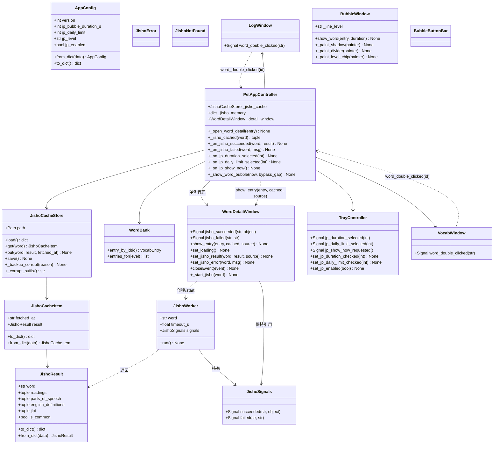
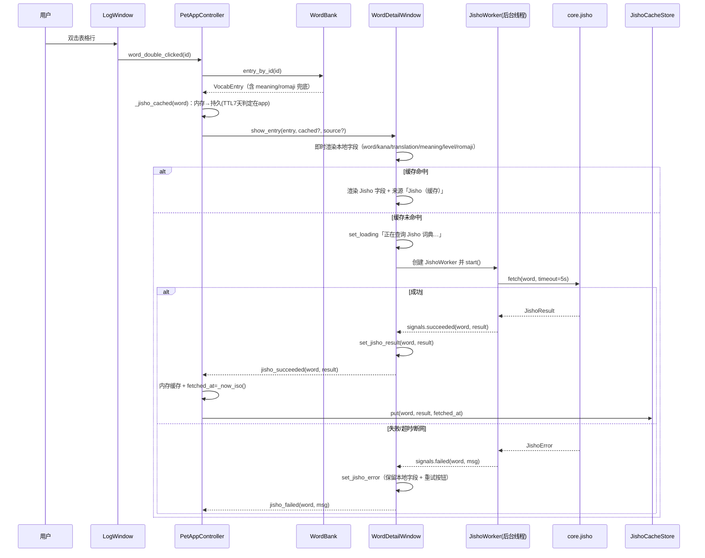
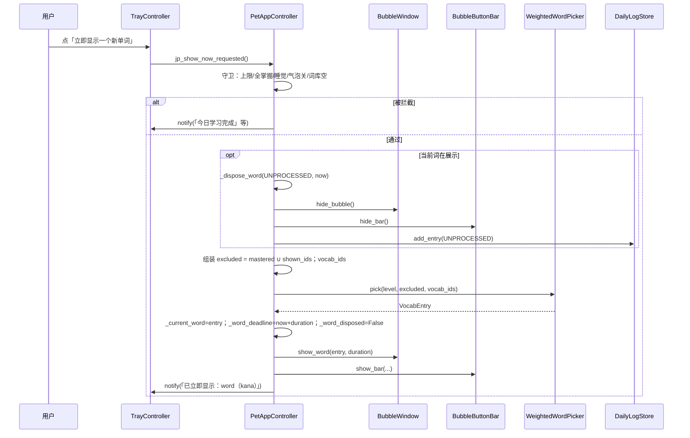
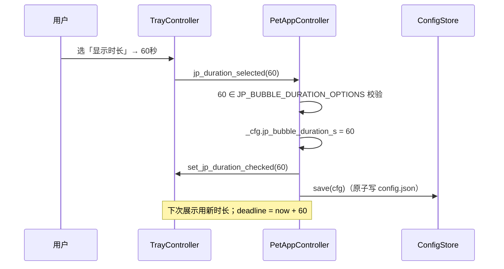
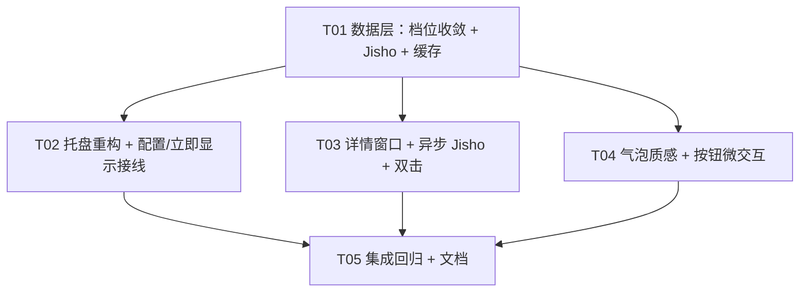

# 桌面宠物「日语学习 · 配置与详情」B 版增量架构设计

> 配套 PRD：`docs/prd-japanese-config.md`（JC-01 ~ JC-14）
> 增量基础：A 版记忆闭环 `docs/design-japanese-memory.md`（JM-01~JM-16，已实现）
> 本文档只描述 B 版**新增/变更**，不重写 A 版三态记忆闭环、每日配额、跨日重置、回查语义。

> 路径约定：项目根 = `C:\Users\王佐成\WorkBuddy\软件开发\desktop-pet`；源码包根 = `src/desktop_pet/`。
> 下文相对路径均以**项目根**为基准；包内引用仍写作 `desktop_pet.core.*` / `desktop_pet.ui.*`。

---

## Part A —— 系统设计

### A1. 实现方案与框架选型

#### A1.1 核心技术难点与应对

| 难点 | 应对方案 |
| --- | --- |
| 配置项从「连续值钳制」收敛为「档位枚举」 | `_coerce_duration` / `_coerce_daily_limit` 改为「命中集合则保留、否则回落默认」，返回 `int`；旧值（45→30、2→30、7→15）自动兼容，不升 `CONFIG_VERSION` |
| 「立即显示」与「当前词在展示」竞态 | 采用**方案 A**：先 `_dispose_word(UNPROCESSED)`（等价超时）再立即展示新词；复用既有单飞路径，不新增竞态 |
| 异步 Jisho 查询的线程模型 | `core/jisho.py` 纯同步 `urllib.request`（**不开线程、不 import Qt/time**）；`ui/jisho_worker.py` 用 `QRunnable + Signals(QObject)` 跑，`WordDetailWindow` 持有 `QThreadPool`，信号 `QueuedConnection` 回主线程；窗口关闭即 `clear()+disconnect+_closed` 守卫 |
| 详情窗口「先本地即时渲染、后异步回填」 | `show_entry()` 同步渲染本地字段 → 缓存命中直接填、未命中先「加载中」再发请求；网络绝不阻塞窗口 |
| Jisho 缓存零 time 边界 | `JishoCacheStore` 只存 `fetched_at`（app 注入 ISO8601 UTC 字符串）；**TTL 判定在 app 层**（`datetime.now(timezone.utc)` 对比），与 `DailyLogStore` 的 `day` 注入约定一致 |
| 托盘菜单增删 | 删「加入生词本」+ 信号 + 槽；新增「显示时长」「每日数量」子菜单（`QActionGroup` 单选）+「立即显示」；置灰策略沿用 JM 范式 |
| 双击触发详情 | `LogWindow` / `VocabWindow` 发 `word_double_clicked(str id)`；controller 用 `WordBank.entry_by_id(id)` 还原完整 `VocabEntry` 再打开单例详情窗口 |
| 气泡质感重构 | 纯 QPainter 矢量：body 三段垂直渐变 + 底部柔和阴影（多层半透明圆角矩形错位）+ 分组分割线 + 等级角标 chip + 按钮微交互；新增配色/尺寸全部集中 `constants.py` |

#### A1.2 框架选型

- **沿用** Python 3.13 + PySide6 6.9.x，**零新增第三方依赖**。
- 联网：标准库 `urllib.request` + `urllib.parse.quote` + `json`，超时 `5s`，仅用户主动双击触发，不引入 `requests`/`httpx`。
- 架构模式：继续 `app → ui → core` 严格单向；`core/` 零 Qt、零 `time`/`datetime`；`ui/` 不 import `app`。

#### A1.3 关键决策（已由 team-lead 拍板，直接落地）

1. 时长档位 `{15, 30, 60}`，默认 30；每日数量档位 `{5, 10, 15, 20, 30}`，默认 15。
2. 「立即显示」遇当前词在展示：先 `_dispose_word(UNPROCESSED)` 再 `_show_word_bubble(now, bypass_gap=True)`。
3. Jisho 英文释义与本地中文并存，来源标注「Jisho（英文）/ 本地（中文）」，不做机器翻译。
4. 缓存：内存缓存 P0（会话内），持久化 `jisho_cache.json` + TTL 7 天进 P1，详情窗口带「重试/刷新」。
5. 生词本双击详情 P1，复用同一 `WordDetailWindow`。
6. 联网 `urllib.request`、超时 5s、仅用户双击触发。

---

### A2. 文件清单

#### A2.1 新建文件

| 相对路径 | 职责 |
| --- | --- |
| `src/desktop_pet/core/jisho.py` | `JishoResult` dataclass + `JishoError`/`JishoNotFound` + `fetch()`/`build_url()`/`parse()`（纯同步、零 Qt 零 time） |
| `src/desktop_pet/core/jisho_cache_store.py` | `JishoCacheItem` + `JishoCacheStore`（原子写 + 逐字段容错 + 损坏备份，范式同 `VocabStore`） |
| `src/desktop_pet/ui/jisho_worker.py` | `JishoSignals(QObject)` + `JishoWorker(QRunnable)`，把 `core.jisho.fetch` 放到后台线程并回传信号 |
| `src/desktop_pet/ui/word_detail_window.py` | `WordDetailWindow`（非模态、单例、三态渲染 + 重试，持有 `QThreadPool`） |
| `tests/test_jisho.py` | `core.jisho` 单测（URL 构造 / 解析 / 无结果 / 异常） |
| `tests/test_jisho_cache_store.py` | 缓存 store 单测（容错读 / 原子写 / 损坏备份 / 逐字段容错） |
| `tests/test_word_detail_window.py` | 详情窗口冒烟（本地渲染 / 三态 / 关闭取消 / 单例由 controller 管） |
| `tests/test_jp_bubble_visual.py` | 气泡质感冒烟（新常量存在 / 等级 chip 字段 / 无图片 / BASE_W/H 不变） |

#### A2.2 修改文件

| 相对路径 | 变更 |
| --- | --- |
| `src/desktop_pet/core/constants.py` | 新增档位/菜单/Jisho/详情窗口/气泡质感常量；清理死常量（`JP_MENU_REMEMBER*`、`JP_MENU_ADD_VOCAB*`、`JP_NOTIFY_NO_WORD`、`JP_DAILY_LIMIT_MAX`） |
| `src/desktop_pet/core/config.py` | `_coerce_duration`/`_coerce_daily_limit` 改为档位收敛；`jp_bubble_duration_s` 改 `int`；`to_dict` 类型调整 |
| `src/desktop_pet/core/vocabulary.py` | 新增 `WordBank.entry_by_id(id)`（详情按 id 还原完整词条） |
| `src/desktop_pet/ui/tray.py` | 删「加入生词本」+ 信号 + `set_jp_current_word`；新增「显示时长/每日数量」子菜单 + 「立即显示」；新增 `set_jp_duration_checked`/`set_jp_daily_limit_checked`；扩展 `set_jp_enabled` 置灰 |
| `src/desktop_pet/ui/bubble.py` | `show_word` 记录 `_line_level`；`paintEvent` 增阴影/分割线/等级角标；body 渐变扩展 |
| `src/desktop_pet/ui/bubble_button_bar.py` | 按钮 QSS 微交互打磨（渐变 + 轻投影 + 悬停/按下） |
| `src/desktop_pet/ui/log_window.py` | 新增 `word_double_clicked = Signal(str)`（携带 entry.id） |
| `src/desktop_pet/ui/vocab_window.py` | 新增 `word_double_clicked = Signal(str)`（携带 item.id，P1） |
| `src/desktop_pet/app/controller.py` | 删 `_on_jp_add_vocab`；新增时长/每日数量槽、`_on_jp_show_now`、`_show_word_bubble(bypass_gap)`、`_open_word_detail`/`_on_jisho_succeeded`/`_on_jisho_failed`、`_jisho_cached`、详情单例与缓存接线 |
| `tests/test_config.py` | 档位收敛断言重写（原钳制断言失效） |
| `tests/test_static_constraints.py` | 新 core 模块纳入「import 不加载 Qt」清单；新增常量断言；删 `JP_DAILY_LIMIT_MAX` 断言 |
| `tests/test_jp_ui.py` | 托盘菜单结构/置灰/信号用例更新（删 add_vocab，增 duration/daily_limit/show_now） |
| `tests/test_jp_memory_ui.py` | 新增立即显示（方案 A）、配置切换冒烟用例 |
| `tests/manual_checklist.md` | 增补 B 版手工验收项 |
| `README.md` / `overview.md` | 托盘菜单与详情功能说明微调（T05，可选） |
| `desktop-pet.spec` | **预期无需改动**（`jisho_cache.json` 是运行时用户数据，不打进包；T05 复核确认） |

---

### A3. 数据模型与接口（类图）

> 仅画 B 版新增/变更的类；A 版既有类（`VocabEntry`、`VocabStore` 等）只标出被触碰的方法。



#### A3.1 关键接口签名（B 版新增/变更）

```python
# core/jisho.py —— 纯同步，零 Qt 零 time
@dataclass(frozen=True)
class JishoResult:
    word: str
    readings: tuple[str, ...]
    parts_of_speech: tuple[str, ...]
    english_definitions: tuple[str, ...]
    jlpt: tuple[str, ...]
    is_common: bool
    def to_dict(self) -> dict: ...
    @classmethod
    def from_dict(cls, data) -> "JishoResult | None": ...

class JishoError(Exception): ...
class JishoNotFound(JishoError): ...

def build_url(keyword: str) -> str: ...          # urlencode 词条
def fetch(keyword: str, timeout_s: float = 5.0) -> JishoResult: ...
def parse(payload: dict) -> JishoResult | None: ...  # 取 data[0]，无结果→None

# core/jisho_cache_store.py
@dataclass(frozen=True)
class JishoCacheItem:
    fetched_at: str            # app 注入 ISO8601 UTC
    result: JishoResult
    def to_dict(self) -> dict: ...
    @classmethod
    def from_dict(cls, data) -> "JishoCacheItem | None": ...

class JishoCacheStore:
    def __init__(self, path: Path) -> None: ...
    @staticmethod
    def default_path() -> Path: ...             # %APPDATA%/desktop-pet/jisho_cache.json
    def load(self) -> dict[str, JishoCacheItem]: ...
    def get(self, word: str) -> JishoCacheItem | None: ...
    def put(self, word: str, result: JishoResult, fetched_at: str) -> None: ...
    def save(self) -> None: ...                 # 原子写 + 损坏备份

# ui/jisho_worker.py
class JishoSignals(QObject):
    succeeded = Signal(str, object)             # (word, JishoResult)
    failed = Signal(str, str)                   # (word, error_message)

class JishoWorker(QRunnable):
    def __init__(self, word: str, timeout_s: float) -> None: ...
    def run(self) -> None: ...                  # 调 core.jisho.fetch，异常转 failed

# ui/word_detail_window.py
class WordDetailWindow(QWidget):
    jisho_succeeded = Signal(str, object)       # 上报 controller 持久化
    jisho_failed = Signal(str, str)
    def __init__(self, pool: QThreadPool | None = None, parent=None) -> None: ...
    def show_entry(self, entry: VocabEntry,
                   cached: JishoResult | None = None,
                   source: str | None = None) -> None: ...
    def set_jisho_result(self, word, result, source="Jisho") -> None: ...
    def set_jisho_error(self, word, msg) -> None: ...
    def closeEvent(self, event) -> None: ...    # clear pool + disconnect + _closed

# ui/log_window.py / vocab_window.py 增量
word_double_clicked = Signal(str)               # 携带 entry.id / item.id

# ui/tray.py 增量
jp_duration_selected = Signal(int)
jp_daily_limit_selected = Signal(int)
jp_show_now_requested = Signal()
def set_jp_duration_checked(self, value: int) -> None: ...
def set_jp_daily_limit_checked(self, value: int) -> None: ...

# app/controller.py 增量
def _on_jp_duration_selected(self, value: int) -> None: ...
def _on_jp_daily_limit_selected(self, value: int) -> None: ...
def _on_jp_show_now(self) -> None: ...
def _show_word_bubble(self, now: float, bypass_gap: bool = False) -> None: ...
def _open_word_detail(self, entry: VocabEntry) -> None: ...
def _jisho_cached(self, word: str) -> tuple[JishoResult | None, str | None]: ...
def _on_jisho_succeeded(self, word: str, result: JishoResult) -> None: ...
def _on_jisho_failed(self, word: str, msg: str) -> None: ...
```

---

### A4. 程序调用流程（时序图）

#### A4.1 双击详情 → 本地即时渲染 → 异步 Jisho → 三态回填



#### A4.2 立即显示 → 未处理当前词 → 展示新词（方案 A）



#### A4.3 配置切换 → 持久化 → 回显



---

### A5. 待明确事项

1. **`JP_DAILY_LIMIT_MAX` 去留**：收敛为档位后该常量失去语义。建议**物理删除**并同步删除 `test_static_constraints.py` 中 `("JP_DAILY_LIMIT_MAX", 200)` 断言；`JP_BUBBLE_MIN_DURATION_S/MAX_DURATION_S` **保留**（`BubbleWindow`/`BubbleButtonBar` 仍在 UI 层做展示安全钳制，避免散改）。
2. **死常量清理范围**：`JP_MENU_REMEMBER`/`JP_MENU_REMEMBER_TEMPLATE`（A 版已死）、`JP_MENU_ADD_VOCAB`/`JP_MENU_ADD_VOCAB_TEMPLATE`、`JP_NOTIFY_NO_WORD` 一并删除；`JP_NOTIFY_REMEMBER_ADDED/DUPLICATE` **保留**（气泡「新单词」按钮的 `_dispose_word(VOCAB)` 路径仍在用）。
3. **VocabItem 还原 VocabEntry**：生词本双击时 `VocabItem` 无 `romaji`。方案：优先 `WordBank.entry_by_id(id)`；词库找不到时用 `VocabItem` 字段构造兜底 `VocabEntry(romaji="")`。
4. **Jisho 无结果 / 字段缺失**：`parse` 无 `data[0]` → 抛 `JishoNotFound`（窗口显示「未找到该词，已显示本地词条」）；`jlpt` 缺失显示「—」，`is_common=False` 不显示「常见」角标。

---

## Part B —— 任务分解

### B6. 依赖包列表

**无新增**。沿用 `PySide6`、`pynput`（`pyproject.toml` 已声明）；联网仅标准库 `urllib.request` / `urllib.parse` / `json`。

```
- （空）B 版不引入任何新第三方依赖
```

### B7. 任务列表（按实现顺序，5 个任务）

> 每个任务「改哪个文件 / 加什么 / 验收点」；依赖以 `TaskID` 标注。

#### T01 数据层：配置档位收敛 + Jisho 解析与缓存（core 零 Qt 零 time）

- **文件**：
  - 改 `src/desktop_pet/core/config.py`
  - 改 `src/desktop_pet/core/constants.py`
  - 改 `src/desktop_pet/core/vocabulary.py`
  - 新 `src/desktop_pet/core/jisho.py`
  - 新 `src/desktop_pet/core/jisho_cache_store.py`
  - 改 `tests/test_config.py`、`tests/test_static_constraints.py`
  - 新 `tests/test_jisho.py`、`tests/test_jisho_cache_store.py`
- **加什么**：
  1. `constants.py`：新增 `JP_BUBBLE_DURATION_OPTIONS/LABELS`、`JP_DAILY_LIMIT_OPTIONS/LABELS`、`JP_MENU_DURATION/DAILY_LIMIT/SHOW_NOW`、`JP_NOTIFY_SHOW_NOW`、`JISHO_*`（API URL、`TIMEOUT_S=5.0`、`MAX_DEFINITIONS=6`、缓存文件名/版本、`TTL_DAYS=7`）、`WORD_DETAIL_*`（标题/尺寸/文案/来源标注）、气泡质感色 `bubble_shadow`/`bubble_divider`/`bubble_gradient_bottom`/`jp_level_chip_bg`/`jp_level_chip_text`；删死常量（见 A5）。
  2. `config.py`：`_coerce_duration`→`_coerce_int` 后「命中 `{15,30,60}` 否则 30」；`_coerce_daily_limit`→「命中 `{5,10,15,20,30}` 否则 15」；`AppConfig.jp_bubble_duration_s` 改 `int`；`to_dict` 用 `int(...)`。
  3. `vocabulary.py`：`WordBank.entry_by_id(item_id)`。
  4. `jisho.py`：`JishoResult`（frozen + `to_dict/from_dict`）、`JishoError`/`JishoNotFound`、`build_url/fetch/parse`，全部纯标准库。
  5. `jisho_cache_store.py`：完全复刻 `VocabStore` 范式（原子写 + 逐字段容错 + `*.corrupt-*` 备份；`fetched_at` 由 app 注入）。
- **验收点**：`pytest tests/test_config.py tests/test_jisho.py tests/test_jisho_cache_store.py tests/test_static_constraints.py` 全绿；`core/` 无 Qt、无 `time`/`datetime`（子进程导入不加载 PySide6 断言仍绿）。

#### T02 托盘菜单重构 + 配置切换 / 立即显示接线

- **文件**：
  - 改 `src/desktop_pet/ui/tray.py`
  - 改 `src/desktop_pet/app/controller.py`
  - 改 `tests/test_jp_ui.py`、`tests/test_jp_memory_ui.py`
- **加什么**：
  1. `tray.py`：删 `jp_add_vocab_requested` + `_action_jp_add_vocab` + `set_jp_current_word`；新增「显示时长」「每日数量」子菜单（`QActionGroup` 互斥单选）+「立即显示」action；新增 `set_jp_duration_checked`/`set_jp_daily_limit_checked`；`set_jp_enabled` 扩展为「难度/显示时长/每日数量/立即显示」置灰、「生词本/学习记录」常亮。
  2. `controller.py`：`_connect_signals` 接 `jp_duration_selected`/`jp_daily_limit_selected`/`jp_show_now_requested`，删 `_on_jp_add_vocab` 及 `set_jp_current_word` 调用；新增 `_on_jp_duration_selected`/`_on_jp_daily_limit_selected`/`_on_jp_show_now`；`_show_word_bubble(now, bypass_gap=False)`（`bypass_gap=True` 跳过 `BUBBLE_MIN_GAP_S`，**保留**上限/全掌握/睡觉/气泡关守卫）。
- **验收点**：托盘菜单结构 =「日语学习/难度/显示时长/每日数量/立即显示/生词本/学习记录」；`pytest tests/test_jp_ui.py tests/test_jp_memory_ui.py` 全绿；立即显示方案 A 语义（当前词先未处理、再弹新词、shown_today+1）用例通过。

#### T03 单词详情窗口 + 异步 Jisho + 双击触发

- **文件**：
  - 新 `src/desktop_pet/ui/jisho_worker.py`
  - 新 `src/desktop_pet/ui/word_detail_window.py`
  - 改 `src/desktop_pet/ui/log_window.py`、`src/desktop_pet/ui/vocab_window.py`
  - 改 `src/desktop_pet/app/controller.py`
  - 新 `tests/test_word_detail_window.py`
- **加什么**：
  1. `jisho_worker.py`：`JishoSignals(QObject)` + `JishoWorker(QRunnable)`，`run()` 调 `core.jisho.fetch` 并转 `succeeded`/`failed`。
  2. `word_detail_window.py`：本地字段即时渲染 + 三态（加载中/成功/失败）+ 重试 + 来源标注 + `closeEvent` 取消（`pool.clear()` + `disconnect` + `_closed` 守卫）；`show_entry(entry, cached, source)` 支持缓存直填。
  3. `log_window.py`/`vocab_window.py`：`word_double_clicked = Signal(str)`，`cellDoubleClicked` 发当前行 id。
  4. `controller.py`：`_detail_window` 单例（懒创建 + 关闭置 None + 可重建）；`_jisho_memory`（P0）+ `_jisho_cache`（P1）+ `_jisho_cached`（TTL 在 app）；`_open_word_detail`；`_on_jisho_succeeded`/`_on_jisho_failed`（写内存 + 持久缓存 + 回填窗口）。
- **验收点**：双击日志行秒开详情且本地字段先出、网络后填；断网降级 + 重试；单例/重开前置；窗口关闭后 worker 不回调已销毁对象；`pytest tests/test_word_detail_window.py` 全绿。

#### T04 气泡质感重构 + 按钮微交互

- **文件**：
  - 改 `src/desktop_pet/ui/bubble.py`
  - 改 `src/desktop_pet/ui/bubble_button_bar.py`
  - 新 `tests/test_jp_bubble_visual.py`
- **加什么**：
  1. `bubble.py`：`show_word` 记录 `_line_level`；`paintEvent` 用三段垂直渐变（顶高光→奶白→底部略深）、底部柔和阴影（多层半透明圆角矩形错位）、「单词/假名」与「翻译/释义」间分割线、右上角等级 chip（`N5`）；文字区仍 `WindowTransparentForInput` 透传。
  2. `bubble_button_bar.py`：主按钮渐变填充 + 轻投影、次按钮描边，悬停/按下反馈打磨。
- **验收点**：`pytest tests/test_jp_bubble_visual.py` 全绿；无新增图片（静态约束仍绿）；`BASE_W/BASE_H` 不变；按钮条「不含穿透标志」断言仍绿。

#### T05 集成回归 + 文档

- **文件**：
  - 改 `tests/manual_checklist.md`
  - 改 `README.md` / `overview.md`（可选微调）
  - 复核 `desktop-pet.spec`（预期无改动）
- **加什么**：跑全量 `pytest`；补齐手工验收清单（时长/每日数量菜单、立即显示、详情三态、断网降级、缓存 TTL、气泡质感）；核对打包不引入 `jisho_cache.json`。
- **验收点**：全量测试绿；`test_static_constraints.py`（core 零 Qt/零 time、无 print、无图片、依赖方向）绿；手工清单覆盖 B 版全部 P0/P1。

### B8. 共享知识（跨文件约定）

- **常量命名前缀**：`JP_*`（日语学习通用）、`JP_BUBBLE_*`（气泡）、`JP_MENU_*`（托盘文案）、`JP_NOTIFY_*`（通知文案）、`JISHO_*`（Jisho）、`WORD_DETAIL_*`（详情窗口）、气泡质感色进 `COLORS`。唯一来源 `core/constants.py`，禁止散落硬编码。
- **store 范式**：读 = 逐字段容错（非法字段回落/跳过）；写 = `tempfile.mkstemp` 同目录 + `flush/fsync` + `os.replace` 原子替换；用户数据损坏 = 先 `os.replace` 备份为 `<name>.corrupt-<mtime>` 再继续，**绝不静默清空**。
- **时间注入约定（core 零 time）**：`core/` 不 import `time`/`datetime`。`fetched_at`/`shown_at`/`mastered_at`/`added_at` 由 app 层生成 ISO8601 UTC 字符串（`_now_iso()`）注入；`day` 由 app 生成 `YYYY-MM-DD`（`_local_date_str()`）注入；**TTL 判定在 app 层**（`datetime.now(timezone.utc)` 对比 `fetched_at` 是否超 `JISHO_CACHE_TTL_DAYS`）。
- **线程边界**：`core/jisho.py` 纯同步；`QThreadPool`/`QRunnable`/`QThread` 只在 `ui`/`app` 层；`JishoSignals` 在主线程创建、`succeeded/failed` 跨线程经 `QueuedConnection` 回主线程；窗口关闭时 `pool.clear()` + `disconnect` + `_closed` 守卫，避免回调已销毁对象。
- **信号命名**：托盘用 `<event>_requested`/`<state>_selected`/`<state>_toggled`；窗口双击用 `word_double_clicked(str id)`；worker 用 `succeeded(str word, object result)`/`failed(str word, str msg)`。
- **分层铁律**：`app → ui → core` 单向；`core/` 零 Qt、零 time；`ui/` 不 import `app`；全项目无 `print`（统一 `logging`）；零外部图片素材（纯 QPainter）。
- **档位语义**：`jp_bubble_duration_s` 恒 ∈ `{15,30,60}`、`jp_daily_limit` 恒 ∈ `{5,10,15,20,30}`；配置层负责收敛，UI 层只信任档位值。

### B9. 任务依赖图



> 说明：T02 与 T03 都改 `app/controller.py`，但改动区域互不重叠（T02=配置/立即显示槽；T03=详情单例+缓存+worker 接线）。**建议单工程师按 T02 → T03 顺序串行实现**以避免同文件冲突，其余任务可在 T01 后并行。
