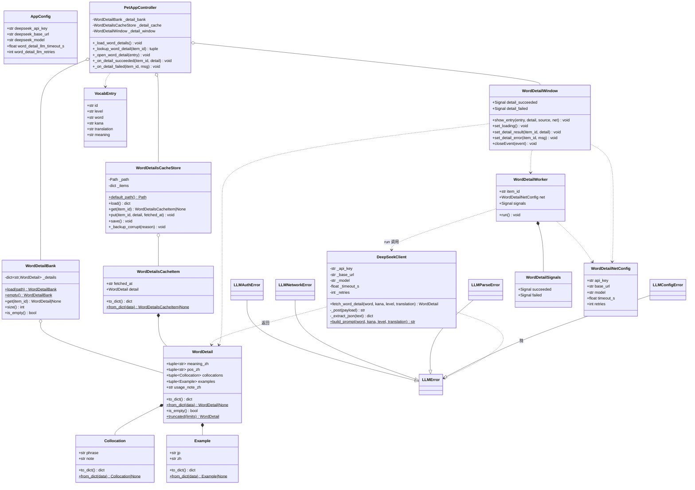
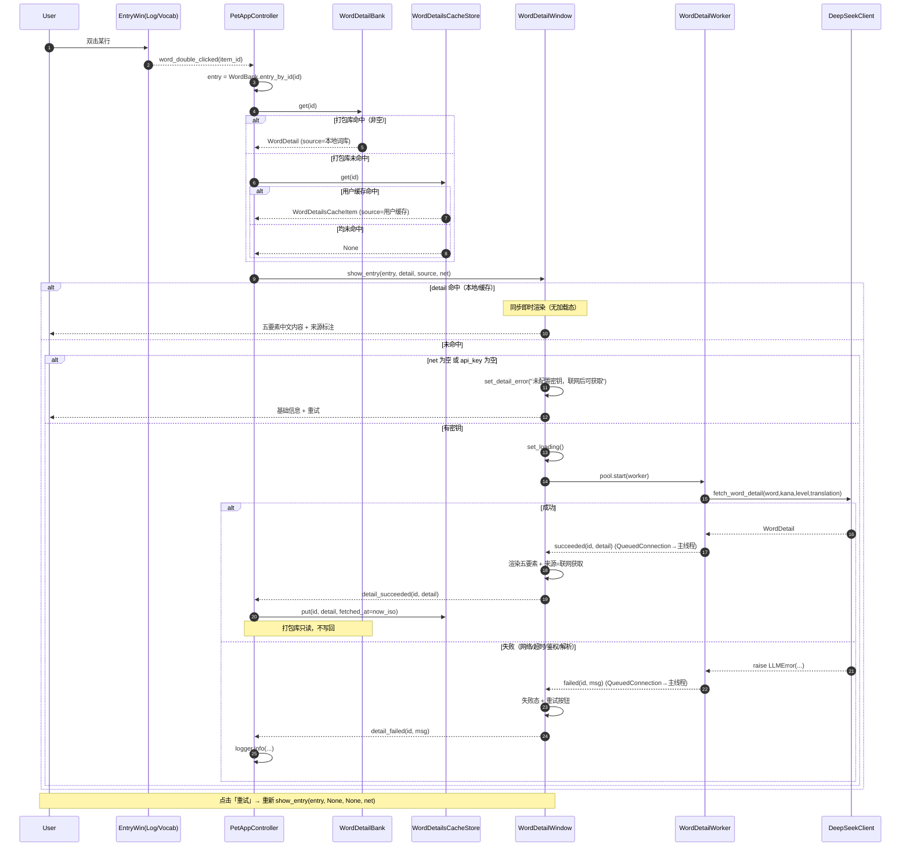

# 系统设计（增量）：日语单词详情页·纯中文五要素改造
> ⚠️ 历史归档：本文提到的 Jisho 链路已于 2026-09-18 随代码瘦身移除（生产侧零引用）。正文保留为历史设计记录，不再随代码同步。

- **文档版本**：v1.0（增量，与 PRD `docs/prd-japanese-detail-zh.md` v1.0 对齐）
- **项目**：desktop-pet（Python 3.13 + PySide6 6.9.3）
- **Language**：中文
- **改造对象**：`src/desktop_pet/ui/word_detail_window.py`（B 版详情窗口）
- **数据策略**：本地优先（打包详情库）→ 用户缓存 → 联网兜底（DeepSeek）
- **架构铁律**（沿用）：`app → ui → core` 严格单向；`core/` 零 Qt/GUI、零 `time`/`datetime`；常量唯一来源 `core/constants.py`；零外部图片素材；禁止 `print`；联网仅标准库 `urllib`。

---

## Part A：系统设计

### 1. 实现方案 + 框架选型

**核心难点**：
1. 打包内置的只读详情库（500 词）在源/冻结两种环境下的定位与**加载容错**（文件缺失/损坏不得崩溃）。
2. 用户级联网结果缓存的**原子写 + 逐字段容错 + 损坏备份**（复刻既有 store 范式）。
3. 纯标准库 `urllib` 调用 DeepSeek OpenAI 兼容接口 + **严格 JSON 提取容错**。
4. 详情窗口：本地命中**同步即时渲染（无加载态闪烁）**，仅联网路径呈现三态。
5. 继续遵守「`core` 零 Qt / 零 time、线程与信号只在 `ui`/`app`」的边界。

**框架与库选型**（**零新增第三方依赖**）：

| 关注点 | 选型 | 理由 |
|--------|------|------|
| GUI | PySide6 6.9.3（沿用） | 现有栈，不改 |
| 联网 | 标准库 `urllib.request` + `json` | 硬约束；不引入 requests/httpx |
| 异步 | `QThreadPool` + `QRunnable` + `QObject` 信号（沿用 B 版范式） | 与 `jisho_worker` 同构，跨线程 `QueuedConnection` 回主线程 |
| 数据模型 | `dataclasses(frozen=True)` + 逐字段容错 `from_dict/to_dict` | 与 `VocabEntry`/`JishoResult` 一致 |
| 持久化 | `tempfile.mkstemp` + `fsync` + `os.replace` 原子写 | 复刻 `VocabStore`/`JishoCacheStore` 范式 |

**关键决策**：
- **worker 复用 vs 新建**：**新建 `ui/word_detail_worker.py`**。载荷（`WordDetail`）与异常类型（`LLMError` 族）与 Jisho 不同，且 `jisho_worker` 命名专指 Jisho；新建可让错误语义清晰、避免污染既有文件。
- **Jisho 代码去留**：**保留 `core/jisho.py`、`core/jisho_cache_store.py`、`ui/jisho_worker.py` 文件不动，但从详情窗口/controller 解绑**（不再 import、不再在详情链路装配）。理由：本次仅去掉英文展示，文件删除属大范围改动，易引发回归；保留可零成本回退，且其单测继续有效。
- **查找顺序**：**打包库优先，缓存补充**。理由：打包库是经审核的**权威只读版本**，发布新版本即应生效，不应被用户旧联网结果覆盖；缓存只补充「打包库未收录」的冷门词，避免同 id 出现「旧缓存遮挡新内容」。
- **缓存 TTL**：默认**永久有效**（`WORD_DETAILS_CACHE_TTL_DAYS = 0` → 不失效）。详情内容稳定，重复联网只增耗时与费用；`fetched_at` 仅作排查留痕。若未来需失效，TTL 判定统一放在 **app 层**（与 `JishoCacheStore` 约定一致）。
- **配置版本**：**`CONFIG_VERSION` 保持 1，不变更**。新增 5 个键均为「缺省回落默认」的加法式扩展，旧 `config.json` 无这些键时经逐字段容错自动取默认，无需迁移。

---

### 2. 文件清单（相对路径）

**新增（7）**
```
src/desktop_pet/core/word_detail.py                    # 数据模型 WordDetail/Collocation/Example + 容错
src/desktop_pet/core/word_detail_bank.py               # 打包详情库只读加载器 WordDetailBank
src/desktop_pet/core/word_details_cache_store.py       # 用户缓存 WordDetailsCacheItem/Store（原子写+备份）
src/desktop_pet/core/llm_client.py                     # DeepSeek 同步客户端 + 严格 JSON 提取 + 异常分类
src/desktop_pet/ui/word_detail_worker.py               # WordDetailSignals + WordDetailWorker(QRunnable)
src/desktop_pet/data/jlpt_word_details.json            # 打包内置详情库（500 词，内容生成任务产物）
tools/build_word_details.py                            # 分片合并 + 结构校验脚本（内容生成任务）
```

**修改（5）**
```
src/desktop_pet/core/constants.py                      # §13 新增中文详情/LLM/缓存常量；§12 清理 Jisho 详情专用文案
src/desktop_pet/core/config.py                         # AppConfig 增 5 项 + _coerce_str + 逐字段容错
src/desktop_pet/core/paths.py                          # 新增 word_details_path()
src/desktop_pet/ui/word_detail_window.py               # 重写为五要素中文渲染（移除 Jisho 区）+ 三态 + 来源
src/desktop_pet/app/controller.py                      # 装配详情库/缓存/联网；查找顺序；worker 接线；解绑 Jisho
```

**测试（新增 5 / 修改 1）**：`tests/test_word_detail.py`（模型容错）、`tests/test_word_detail_bank.py`（打包库加载容错）、`tests/test_word_details_cache_store.py`（原子写/备份/容错）、`tests/test_llm_client.py`（mock urllib + JSON 提取容错）、`tests/test_word_detail_data.py`（500 条全量校验）；修改 `tests/test_word_detail_window.py`（改为中文五要素 + 三态，移除 Jisho 断言）。

**不改动**：`src/desktop_pet/data/jlpt_words.json`、`ui/log_window.py`、`ui/vocab_window.py`（两入口信号与现有一致，仅传 `id`）、`core/vocabulary.py`、`core/vocab_store.py`、`core/jisho*.py`、`ui/jisho_worker.py`。

---

### 3. 数据模型与接口

#### 3.1 数据契约（最终定契）

**打包详情库 `jlpt_word_details.json`**（键为词条 `id`）：
```jsonc
{
  "version": 1,
  "details": {
    "n5-0001": {
      "meaning_zh": ["我"],                       // str 或 str[]，多义项
      "pos_zh": ["代词"],                          // str[]，中文词性标签
      "collocations": [{"phrase": "私は…", "note": "自我介绍常用"}],  // obj[]，每条 {phrase, note}
      "examples": [{"jp": "私は学生です。", "zh": "我是学生。"}],       // obj[]，每条 {jp, zh}
      "usage_note_zh": "正式、通用，男女皆可用。"   // str
    }
  }
}
```

**用户缓存 `%APPDATA%\desktop-pet\word_details_cache.json`**：
```jsonc
{
  "version": 1,
  "items": {
    "n3-0042": { "fetched_at": "2026-01-01T00:00:00Z", "detail": { /* 同上五字段 */ } }
  }
}
```

> 契约要点：`meaning_zh` 允许 `str`（自动包成 1 元素元组）或 `str[]`；五字段**均可空**，全部为空视作「本地未命中」；展示上限：释义 ≤3、例句 ≤3、搭配 ≤5。

#### 3.2 类图



#### 3.3 关键接口签名（供 Engineer 落地）

```python
# core/word_detail.py（纯逻辑，零 Qt / 零 time）
@dataclass(frozen=True)
class Collocation: phrase: str; note: str = ""
@dataclass(frozen=True)
class Example:     jp: str;     zh: str = ""
@dataclass(frozen=True)
class WordDetail:                          # 五字段均可空；空 dict → 全空 WordDetail
    meaning_zh: tuple[str, ...] = (); pos_zh: tuple[str, ...] = ()
    collocations: tuple[Collocation, ...] = (); examples: tuple[Example, ...] = ()
    usage_note_zh: str = ""
    @classmethod
    def from_dict(cls, data: Any) -> "WordDetail | None": ...   # 逐字段容错（meaning_zh 兼容 str/str[]）
    def to_dict(self) -> dict[str, Any]: ...
    def is_empty(self) -> bool: ...                             # 五字段全空 → True（= 未命中）

# core/word_detail_bank.py（纯读，零 Qt 零 time）
class WordDetailBank:
    @classmethod
    def load(cls, path: Path) -> "WordDetailBank": ...          # 缺失/损坏 → empty()，仅 warning
    @classmethod
    def empty(cls) -> "WordDetailBank": ...
    def get(self, item_id: str) -> WordDetail | None: ...       # 命中且非空才返回；空 → None
    def size(self) -> int: ...
    def is_empty(self) -> bool: ...

# core/word_details_cache_store.py（范式同 JishoCacheStore）
@dataclass(frozen=True)
class WordDetailsCacheItem: fetched_at: str; detail: WordDetail
class WordDetailsCacheStore:
    def __init__(self, path: Path) -> None: ...
    @staticmethod
    def default_path() -> Path: ...                             # %APPDATA%\desktop-pet\word_details_cache.json
    def load(self) -> dict[str, WordDetailsCacheItem]: ...
    def get(self, item_id: str) -> WordDetailsCacheItem | None: ...
    def put(self, item_id: str, detail: WordDetail, fetched_at: str) -> None: ...
    def save(self) -> None: ...                                 # mkstemp+fsync+os.replace，失败仅 warning

# core/llm_client.py（纯同步 urllib，不开线程）
class LLMError(Exception): ...
class LLMAuthError(LLMError): ...        # 401/403
class LLMNetworkError(LLMError): ...     # URLError/TimeoutError/OSError
class LLMParseError(LLMError): ...       # JSON 解码失败 / 结构非法 / 五字段全空
class LLMConfigError(LLMError): ...      # 空 api_key
class DeepSeekClient:
    def __init__(self, api_key, base_url, model, timeout_s: float, retries: int = 1) -> None: ...
    def fetch_word_detail(self, word, kana="", level="", translation="") -> WordDetail: ...
    @staticmethod
    def build_prompt(word, kana, level, translation) -> list[dict]: ...
    @staticmethod
    def _extract_json(text: str) -> dict: ...                   # 去围栏 + 截取首个 JSON 对象

# ui/word_detail_worker.py（线程边界）
@dataclass(frozen=True)
class WordDetailNetConfig: api_key: str; base_url: str; model: str; timeout_s: float; retries: int
class WordDetailSignals(QObject):
    succeeded = Signal(str, object)   # (item_id, WordDetail)
    failed    = Signal(str, str)      # (item_id, error_message)
class WordDetailWorker(QRunnable):
    def __init__(self, item_id, word, kana, level, translation, net: WordDetailNetConfig) -> None: ...
    def run(self) -> None: ...        # 绝不裸抛；异常转 failed

# ui/word_detail_window.py（重写）
class WordDetailWindow(QWidget):
    detail_succeeded = Signal(str, object); detail_failed = Signal(str, str)
    def show_entry(self, entry: VocabEntry, detail: WordDetail | None = None,
                   source: str | None = None, net: WordDetailNetConfig | None = None) -> None: ...
```

---

### 4. 程序调用流程



**触发路径**：`_on_log_word_double_clicked(id)` / `_on_vocab_word_double_clicked(id)` → `entry_by_id` 还原 `VocabEntry` → `_open_word_detail(entry)`。两入口**共用同一窗口实例与同一 `show_entry`**，字段/版式/状态区完全一致。

---

### 5. Part B：任务分解

#### 5.1 依赖包列表

**无新增第三方依赖。** 全部能力由标准库（`urllib.request`/`json`/`dataclasses`/`tempfile`/`os`）与既有 PySide6 提供。配置/文档/内容生成脚本同样零新依赖。

#### 5.2 任务列表（有序，按实现顺序）

> 硬性约束：任务数 ≤5；每任务 ≥3 个相关文件；按功能模块分组；第一个任务为基础层。

**T01 · 数据契约与基础层（P0，依赖：无）**
- **文件**：`core/word_detail.py`(新)、`core/constants.py`(改)、`core/config.py`(改)、`core/paths.py`(改)、`tests/test_word_detail.py`(新)
- **做**：
  - 新增 `WordDetail/Collocation/Example`（`frozen`）+ `to_dict/from_dict/is_empty/truncated`，逐字段容错（`meaning_zh` 兼容 `str` 与 `str[]`）。
  - `constants.py` 新增 **§13 中文详情**：#字段键名、展示上限（3/3/5）、`WORD_DETAILS_FILE_NAME/VERSION`、`WORD_DETAILS_CACHE_FILENAME/VERSION/TTL`、`LLM_*`（默认 endpoint/model/超时 10s/重试 1/温度/prompt 系统+模板）、窗口中文文案与来源标注。**§12 中仅服务 Jisho 详情展示的 `WORD_DETAIL_*` 文案常量**（`LOADING/NOT_FOUND/ERROR_TEMPLATE/SOURCE_JISHO/SOURCE_CACHE/SOURCE_LOCAL/LABEL_READINGS/PARTS_OF_SPEECH/DEFINITIONS/JLPT/COMMON`）随窗口重写一并替换为中文版；保留 `WORD_DETAIL_WINDOW_TITLE/W/H/CLOSE/NO_VALUE` 与全部 `JISHO_*`。
  - `config.py`：`AppConfig` 增 `deepseek_api_key`(默认空)、`deepseek_base_url`、`deepseek_model`、`word_detail_llm_timeout_s`、`word_detail_llm_retries`；新增 `_coerce_str(value, default, allow_empty)`；`to_dict/from_dict` 同步；**`CONFIG_VERSION` 保持 1**。
  - `paths.py`：新增 `word_details_path()`（`package_data_dir()/C.WORD_DETAILS_FILE_NAME`）。
- **验收点**：`test_word_detail.py` 覆盖 `from_dict` 各非法分支与 `is_empty`；`test_static_constraints.py` 仍过（core 子进程零 Qt、无 print）；`test_config.py` 旧配置逐字段回落、`AppConfig` 往返一致。

**T02 · 本地详情库 & 用户缓存数据层（P0，依赖：T01）**
- **文件**：`core/word_detail_bank.py`(新)、`core/word_details_cache_store.py`(新)、`tests/test_word_detail_bank.py`(新)、`tests/test_word_details_cache_store.py`(新)
- **做**：
  - `WordDetailBank.load/empty/get/size/is_empty`：纯读、零 Qt 零 time；文件缺失/为空/根非对象/`details` 非对象/逐条非法 → 优雅降级（缺失返空、结构损坏仅 warning），`get` 命中空内容返回 `None`。
  - `WordDetailsCacheItem` + `WordDetailsCacheStore`：**复刻 `JishoCacheStore` 范式**（`mkstemp`+`fsync`+`os.replace`；`items` 逐条容错；结构损坏 `os.replace` 备份为 `<name>.corrupt-<mtime秒>`，`_corrupt_suffix` 用 `os.stat().st_mtime` 不 import time）；`fetched_at` 由调用方注入。
- **验收点**：缺失/损坏/半损坏场景不崩溃且产出 `.corrupt-*` 备份；`put` 后 `reload` 可读回；`get` 未知 id 返回 `None`。

**T03 · 联网层（LLM 客户端 + 异步 worker）（P0，依赖：T01）**
- **文件**：`core/llm_client.py`(新)、`ui/word_detail_worker.py`(新)、`tests/test_llm_client.py`(新)
- **做**：
  - `DeepSeekClient`：`urllib.request` POST `{base_url}`（默认 `https://api.deepseek.com/v1/chat/completions`），`Authorization: Bearer <key>`，body `{model, messages, temperature, response_format:{type:"json_object"}}`；**prompt 模板**（见 §7 共享知识）；`_extract_json` 容错：剥离 ``` ```json ``` 围栏 → 取**首个 `{` 到匹配 `}`** → `json.loads`；字段缺失容忍；五字段全空 → `LLMParseError`。异常分类映射为 `LLMConfigError/LLMAuthError/LLMNetworkError/LLMParseError`；`retries` 次重试仅针对网络/超时类。
  - `WordDetailNetConfig` + `WordDetailSignals` + `WordDetailWorker(QRunnable)`：`run()` 调 `DeepSeekClient.fetch_word_detail`，异常转 `failed`（含 `LLMError` 与兜底 `Exception`），成功发 `succeeded`，**绝不裸抛**。
- **验收点**：mock `urllib` 断言 URL/鉴权头/body；`_extract_json` 覆盖「裸 JSON / 带 ```json 围栏 / 前后有解释文字 / 截断非法」；401→`LLMAuthError`、超时→`LLMNetworkError`、坏 JSON→`LLMParseError`；`run()` 不抛。

**T04 · 详情窗口重写与 controller 接线（P0，依赖：T01、T02、T03）**
- **文件**：`ui/word_detail_window.py`(改)、`app/controller.py`(改)、`tests/test_word_detail_window.py`(改)
- **做**：
  - 重写窗口：**移除 Jisho 区**与 `jisho_*` 信号；改为分组渲染五要素（释义分条、词性标签、搭配列表、例句「日文加粗 + 中文次行」、语气提示框），按上限截断；空分组隐藏或显示「暂无」；`detail_succeeded/detail_failed` 信号；`closeEvent` 保留 `pool.clear()+disconnect+_closed` 守卫。
  - `show_entry`：`detail` 非空 → **同步即时渲染（无加载态）** + 来源=本地词库/用户缓存；否则清空 + 若 `net` 为空或 `api_key` 空 → 离线降级提示 + 重试，否则 `set_loading()` + 起 `WordDetailWorker`。
  - `controller.py`：新增 `_detail_bank/_detail_cache/_detail_window` 与 `_load_word_details()`（启动加载，try/except 降级）；`_lookup_word_detail(id)`（**打包优先 → 缓存补充**）；`_open_word_detail` 改走 `show_entry(entry, detail, source, net)`（`net` 由 `AppConfig` 现取现构，保证运行时改配置即时生效）；`_on_detail_succeeded` 写用户缓存（`fetched_at=self._now_iso()`）；**移除** `_jisho_memory/_jisho_cache/_jisho_cached/_jisho_expired/_on_jisho_succeeded/_on_jisho_failed` 及对应接线（`jisho*.py` 文件保留但不 import）。
- **验收点**：本地/缓存命中**不闪加载态**；未命中且有 Key → 三态 + 重试；无 Key → 友好中文降级且**无英文残留**；两入口渲染一致；关闭无回调崩溃；`controller` 不再引用 Jisho 详情符号。

**T05 · 打包详情库内容生成与校验（P1，依赖：T01）**
- **文件**：`data/jlpt_word_details.json`(新)、`tools/build_word_details.py`(新)、`tests/test_word_detail_data.py`(新)
- **做**：
  - 生成 500 词五要素中文详情（**内容生成任务**，见 §5.3 分工建议），合并为 `{"version":1,"details":{"<id>":{...}}}`。
  - `tools/build_word_details.py`：读取各分片 → 结构校验 → 稳定排序写出（仅构建期运行，不入运行时依赖）。
  - `tests/test_word_detail_data.py`：断言 500 条、id 全覆盖且与 `jlpt_words.json` 一一对应、无重复、字段类型合规、不超过展示上限、无英文残留。
- **验收点**：`jlpt_words.json` 全部 500 id 在详情库中可命中且非空；测试全绿；文件体积合理（仅文本）。

#### 5.3 内容生成分工建议（T05）

按**等级分片并行产出、最后合并校验**：
1. **分片**：以 `level` 过滤 `jlpt_words.json`，得 5 片（N5/N4/N3/N2/N1，各约 100 词）。
2. **并行产出**：每片一名产出者，输入该片词条（含 `id/word/kana/level/translation/meaning`），产出**独立分片文件** `word_details_<level>.json`（键为 `id`）。
3. **统一契约**：所有产出者共用同一 prompt 与字段契约（见 §7），prompt 要求**严格 JSON、勿输出解释文字**。
4. **合并校验**：`tools/build_word_details.py` 汇总分片 → 校验 id 与 `jlpt_words.json` 对齐、字段类型/上限、非空 → 写出 `jlpt_word_details.json`。
5. **终检**：`tests/test_word_detail_data.py` 全量回归；任何缺失/越界条目回流给对应片补齐。

---

### 6. 共享知识（跨文件约定）

- **分层边界**：`app → ui → core` 单向；`core/` **禁止 import Qt/GUI，禁止 import `time`/`datetime`**；时钟/日期（`fetched_at`）一律由 `app` 层 `_now_iso()` 注入。
- **线程边界**：`core/llm_client` 纯同步（`urllib` 阻塞、不开线程、不 import Qt）；`QThreadPool/QRunnable/QObject` 信号**只出现在 `ui`**；跨线程一律 `QueuedConnection` 回主线程；`run()` 内**绝不裸抛**。
- **store 范式**：原子写 `tempfile.mkstemp`（同目录）→ `write/flush/fsync` → `os.replace`；读逐字段容错；**用户数据损坏先备份 `<name>.corrupt-<mtime秒>` 再以空继续，绝不静默清空**；备份后缀用 `os.stat().st_mtime`（不 import time）。
- **常量前缀（唯一来源 `core/constants.py`）**：`WORD_DETAIL_*`（窗口文案/字段键/上限）、`WORD_DETAILS_*`（打包库与缓存文件/版本/文件名）、`LLM_*`（联网默认值/prompt）、`JISHO_*`（保留）。所有阈值/配色/尺寸/文案/上限**只在此定义**。
- **信号命名**：worker 内部 `succeeded/failed`；窗口向上 `detail_succeeded/detail_failed`（均携带 `item_id`）。与既有 `jisho_succeeded/jisho_failed`、`word_double_clicked` 命名风格一致。
- **日志**：统一 `logging.getLogger(__name__)`，**禁止 `print`**；边界处 `except Exception: logger.exception(...)` 后降级。
- **JSON 契约**：打包详情库 `{version, details:{<id>:五字段}}`；用户缓存 `{version, items:{<id>:{fetched_at, detail:{五字段}}}}`；**键一律用词条 `id`**（非词面文本），避免同形冲突。
- **联网约定**：仅标准库 `urllib`；DeepSeek OpenAI 兼容 `POST /v1/chat/completions`、`Bearer` 鉴权、`model=deepseek-chat`；prompt 要求严格 JSON 且无解释文字。
- **LLM prompt 模板（`LLM_PROMPT_*`，纯中文，示例）**：
  - System：`你是严谨的日语词典编辑，只输出一个 JSON 对象，不要任何解释或 Markdown 代码围栏。`
  - User：`请为日语词「{word}」（假名：{kana}，JLPT 等级：{level}，参考中文词义：{translation}）生成中文学习详情。严格只输出 JSON：{"meaning_zh":["…"],"pos_zh":["…"],"collocations":[{"phrase":"…","note":"…"}],"examples":[{"jp":"…","zh":"…"}],"usage_note_zh":"…"}。要求：全部为简体中文；meaning_zh 1~3 条；pos_zh 为中文词性标签；collocations ≤5 条；examples 1~3 条（日文原句+中文翻译）；usage_note_zh 一句语境/语气提示；不确定的字段留空。`
- **配置**：新增 5 项逐字段容错；`deepseek_api_key` 默认空 ⇒ **直接离线降级（不发请求）**；key 明文存 `%APPDATA%\desktop-pet\config.json`，**不入版本库**；`CONFIG_VERSION` 保持 1。

---

### 7. 待明确事项（不阻塞）

1. **API Key 配置入口**：本次仅支持编辑 `config.json`（沿用现有机制）。是否需要在托盘/设置窗口增加输入入口？**建议本次不做**（P2 再议）。
2. **缓存失效策略**：本设计默认「不失效」（`WORD_DETAILS_CACHE_TTL_DAYS=0`）。若 PM 要求可失效，改为 app 层 TTL 判定即可，无需改 store。
3. **短语/多义项上限**：PRD 提到短语类词条搭配/例句数量可放宽，但为版面一致，本设计**统一采用释义≤3/例句≤3/搭配≤5**。若需按词性放宽，请 PM 确认。
4. **`response_format={"type":"json_object"}` 兼容性**：DeepSeek 官方支持；仍保留 `_extract_json` 兜底（去掉该参数也能解析），不构成阻塞。
5. **联网失败文案**：采用统一模板「联网获取失败：{msg}」+ 重试；是否需要按 `LLMError` 子类区分文案（鉴权/网络/解析）由 PM 定，架构默认不区分。

---

**附**：本次增量类图 / 时序图另存为独立文件（**不覆盖** B 版既有的 `docs/class-diagram.mermaid`、`docs/sequence-diagram.mermaid`）：
- 类图：`docs/class-diagram-word-detail-zh.mermaid`
- 时序图：`docs/sequence-diagram-word-detail-zh.mermaid`
