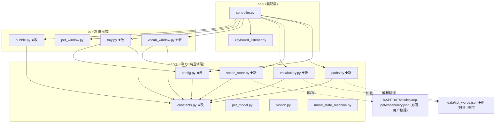
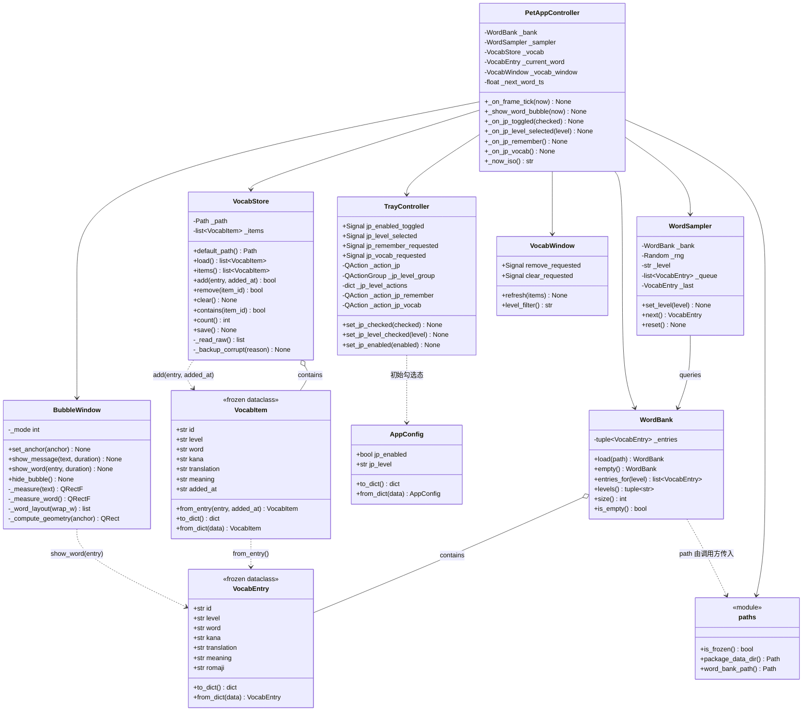
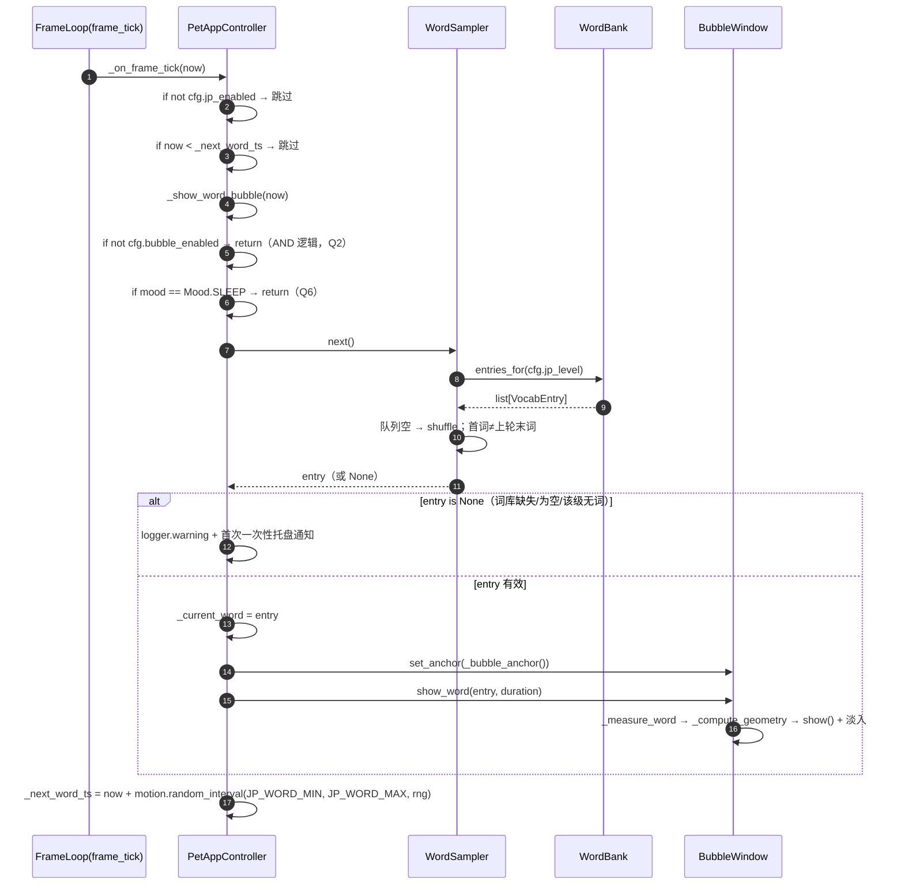
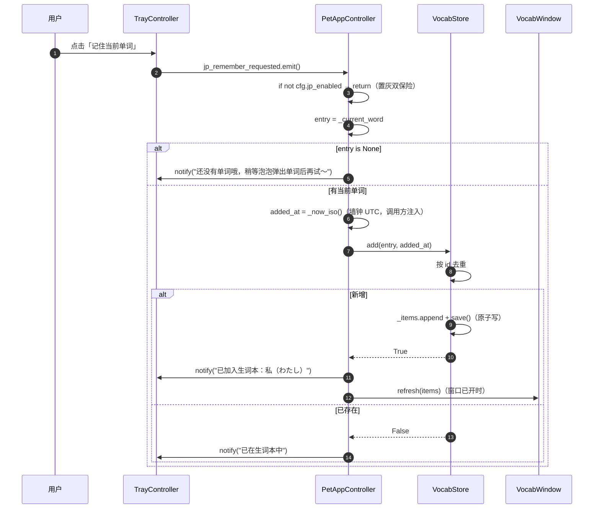
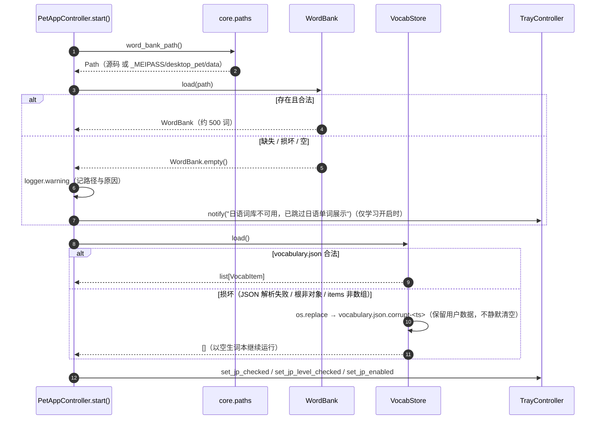

# 桌面宠物 ·「日语教学」功能 —— 系统设计 + 任务分解

> 上游 PRD：`docs/prd-japanese-learning.md`（7 个待确认问题已按推荐项拍板，本设计不再动摇）
> 本文档是**工程师可照着写代码的施工图**。不含任何源码改动。
> 分层红线：`app → ui → core` 严格单向；`core/` 零 Qt；常量唯一来源 `core/constants.py`。

---

## 1. 实现方案总览

**一句话策略**：在 `core/` 新增「只读词库加载 + 洗牌非重复抽取 + 生词本容错存储」三个纯逻辑模块，在 `ui/` 为 `BubbleWindow` 增加一条**四行多字号**渲染路径并新增一个生词本窗口，在 `ui/tray.py` 增加一组日语菜单/信号，最后由 `app/controller.py` 用**帧循环里的独立随机间隔**（沿用「随机打呵欠」范式，不新开 QTimer）把这些接线起来；情绪气泡路径**逐字节不动**。

### 1.1 改动划分

| 层次 | 新建 | 修改 |
| --- | --- | --- |
| `core/` | `paths.py`（资源路径解析）、`vocabulary.py`（`VocabEntry`/`WordBank`/`WordSampler`）、`vocab_store.py`（`VocabItem`/`VocabStore`） | `constants.py`（JP 常量 + `COLORS` 新键）、`config.py`（`AppConfig` 加 `jp_enabled`/`jp_level`） |
| `ui/` | `vocab_window.py`（生词本窗口） | `bubble.py`（`show_word` + 多行渲染）、`tray.py`（日语菜单/信号） |
| `app/` | — | `controller.py`（加载词库/生词本、单词定时、4 个槽、生词本窗口生命周期） |
| `data/` | `jlpt_words.json`（只读词库，随包分发） | — |
| 打包 | — | `desktop-pet.spec`（`datas`）、`pyproject.toml`（`package-data`，推荐） |
| 测试 | `test_vocabulary.py`、`test_vocab_store.py`、`test_jp_ui.py` | `test_static_constraints.py`（`COLORS` 精确相等断言必须同步） |

**新增 5 个源码文件 + 1 个数据文件；修改 5 个源码文件 + 1 个打包配置 + 1 个测试。**

### 1.2 模块依赖图



> 说明：所有 `--` 实线均指**向下**依赖（app→ui/core、ui→core），无反向边。`DATA`/`USER` 通过 `VOC`/`VSTORE` 间接访问，不引入新依赖。

---

## 2. 文件列表及相对路径

| 路径（相对项目根） | 新建/修改 | 职责（一句话） | 预估行数 |
| --- | --- | --- | --- |
| `src/desktop_pet/core/constants.py` | 修改 | 新增 JP 常量段 + `COLORS` 次级文字色/生词本配色/等级标签色 | +60 |
| `src/desktop_pet/core/config.py` | 修改 | `AppConfig` 增 `jp_enabled: bool` / `jp_level: str` 两字段 + `_coerce_level` | +25 |
| `src/desktop_pet/core/paths.py` | **新建** | 源码 / PyInstaller 冻结两种环境下的词库 JSON 路径解析 | ~45 |
| `src/desktop_pet/core/vocabulary.py` | **新建** | `VocabEntry`、`WordBank`（容错加载+分级）、`WordSampler`（洗牌非重复） | ~180 |
| `src/desktop_pet/core/vocab_store.py` | **新建** | `VocabItem`、`VocabStore`（原子写 + 逐字段容错读 + 损坏备份） | ~200 |
| `src/desktop_pet/data/jlpt_words.json` | **新建** | N5~N1 各级约 100 词、共约 500 词的只读词库 | ~1500（内容） |
| `src/desktop_pet/ui/bubble.py` | 修改 | 新增 `show_word()` + 四行多字号渲染 + `_measure_word` 几何分支 | +90 |
| `src/desktop_pet/ui/tray.py` | 修改 | 日语菜单组（开关/难度/记住/生词本）+ 4 信号 + `set_jp_enabled` | +75 |
| `src/desktop_pet/ui/vocab_window.py` | **新建** | 独立非模态生词本窗口（列表/筛选/删除/清空+二次确认/空态） | ~210 |
| `src/desktop_pet/app/controller.py` | 修改 | 加载词库/生词本、帧循环内单词定时、4 槽、生词本窗口单例 | +120 |
| `desktop-pet.spec` | 修改 | `datas` 纳入词库 JSON | +2 |
| `pyproject.toml` | 修改 | `package-data` 纳入词库 JSON（pip 安装场景，推荐） | +3 |
| `tests/test_static_constraints.py` | 修改 | `test_color_palette_matches_prd` 期望字典同步新增键 | +5 |
| `tests/test_vocabulary.py` | **新建** | 词库加载容错 / 分级 / 洗牌非重复 单测 | ~120 |
| `tests/test_vocab_store.py` | **新建** | 生词本去重 / 原子写 / 损坏备份 / 逐字段容错 单测 | ~140 |
| `tests/test_jp_ui.py` | **新建** | 气泡多行渲染 / 托盘日语菜单/置灰 / 生词本窗口 冒烟 | ~150 |

**不改**：`ui/pet_window.py`、`ui/pet_renderer.py`、`core/pet_model.py`、`core/motion.py`、`core/mood_state_machine.py`、`core/event_aggregator.py`、`main.py`。

---

## 3. 数据结构与接口（类图）



### 3.1 关键签名与实现约定（工程师照写）

**`core/paths.py`（新建，零 Qt）**
```python
def is_frozen() -> bool:                 # getattr(sys, "frozen", False) and hasattr(sys, "_MEIPASS")
def package_data_dir() -> Path:          # 冻结: Path(sys._MEIPASS)/"desktop_pet"/C.WORD_BANK_DIR_NAME
                                         # 源码:  Path(__file__).resolve().parent.parent / C.WORD_BANK_DIR_NAME
def word_bank_path() -> Path:            # package_data_dir() / C.WORD_BANK_FILE_NAME（始终返回意图路径）
```

**`core/vocabulary.py`（新建）**
```python
@dataclass(frozen=True)
class VocabEntry:
    id: str; level: str; word: str; kana: str; translation: str; meaning: str
    romaji: str = ""
    def to_dict(self) -> dict[str, Any]: ...
    @classmethod
    def from_dict(cls, data: Any) -> "VocabEntry | None":   # 任一必填缺失/非 str/空 → 返回 None（跳过该条）

class WordBank:
    @classmethod
    def load(cls, path: Path) -> "WordBank":     # 缺失/损坏/空 → cls.empty()，仅 logger.warning，绝不抛
    @classmethod
    def empty(cls) -> "WordBank": ...
    def entries_for(self, level: str) -> list[VocabEntry]: ...
    def levels(self) -> tuple[str, ...]: ...
    def size(self) -> int: ...
    def is_empty(self) -> bool: ...

class WordSampler:
    def __init__(self, bank: WordBank, rng: random.Random | None = None) -> None: ...
    def set_level(self, level: str) -> None:   # 合法等级新池则清空队列重洗；同级且队列非空则 no-op
    def next(self) -> "VocabEntry | None":     # 队列空→shuffle；新一轮首词 ≠ 上轮末词（长度>1 时首尾对调）
    def reset(self) -> None: ...
```

**`core/vocab_store.py`（新建）**
```python
@dataclass(frozen=True)
class VocabItem:
    id: str; level: str; word: str; kana: str; translation: str; meaning: str; added_at: str
    @classmethod
    def from_entry(cls, entry: VocabEntry, added_at: str) -> "VocabItem": ...
    def to_dict(self) -> dict[str, Any]: ...
    @classmethod
    def from_dict(cls, data: Any) -> "VocabItem | None": ...

class VocabStore:
    def __init__(self, path: Path) -> None: ...
    @property
    def path(self) -> Path: ...
    @staticmethod
    def default_path() -> Path:            # %APPDATA%/desktop-pet/vocabulary.json（APPDATA 缺失回落 Path.home()）
    def load(self) -> list[VocabItem]:     # 容错；损坏 → 备份为 *.corrupt-<ts> 后以空列表启动（数据不丢）
    def items(self) -> list[VocabItem]:    # 返回内部列表（按加入顺序，新在后）
    def add(self, entry: VocabEntry, added_at: str) -> bool:   # True=新增，False=已存在（按 id 去重）
    def remove(self, item_id: str) -> bool: ...
    def clear(self) -> None: ...
    def contains(self, item_id: str) -> bool: ...
    def count(self) -> int: ...
    def save(self) -> None:                # mkstemp + fsync + os.replace 原子写；失败仅 warning
```

**`ui/bubble.py`（修改）—— 新增公开 API**
```python
def show_word(self, entry: "VocabEntry", duration: float) -> None:
    """显示一条日语单词（四行多字号）。空 entry 视为 no-op。duration 同 show_message 钳制到 [2,4]s。"""
```
内部新增（均私有）：`_mode`（`_MODE_TEXT=0` / `_MODE_WORD=1`）、`_line_word/_kana/_translation/_meaning` 四个 str、四个 `QFont`（`_font_word` 粗体 16pt / `_font_kana` 12pt / `_font_trans` 11pt / `_font_meaning` 9pt）、`_measure_word()`、`_word_layout(wrap_w)`。

**`ui/tray.py`（修改）—— 新增信号/方法**
```python
jp_enabled_toggled = Signal(bool)
jp_level_selected = Signal(str)
jp_remember_requested = Signal()
jp_vocab_requested = Signal()

def set_jp_checked(self, checked: bool) -> None: ...        # blockSignals 同步勾选
def set_jp_level_checked(self, level: str) -> None: ...     # blockSignals 同步单选
def set_jp_enabled(self, enabled: bool) -> None: ...        # 统一刷新：难度子菜单 + 记住项置灰/启用；生词本始终可用
```

**`ui/vocab_window.py`（新建）**
```python
class VocabWindow(QWidget):
    remove_requested = Signal(str)   # 携带 item id
    clear_requested = Signal()       # 二次确认通过后发出
    def __init__(self, parent: QWidget | None = None) -> None: ...
    def refresh(self, items: list[VocabItem]) -> None: ...   # 由 controller 喂数据；本地按等级筛选显示
    def level_filter(self) -> str: ...                       # "全部" / "N5".."N1"
    # 内部：QComboBox(筛选) + QTableWidget/QTreeWidget(4列) + [删除选中][清空…] + QLabel 状态栏/空态
```

**`app/controller.py`（修改）—— 新增成员与槽**
```python
self._bank: WordBank = WordBank.empty()
self._sampler: WordSampler = WordSampler(self._bank)
self._vocab: VocabStore = VocabStore(VocabStore.default_path())
self._current_word: VocabEntry | None = None
self._vocab_window: VocabWindow | None = None
self._next_word_ts: float = float("inf")

def _show_word_bubble(self, now: float) -> None: ...
def _on_jp_toggled(self, checked: bool) -> None: ...
def _on_jp_level_selected(self, level: str) -> None: ...
def _on_jp_remember(self) -> None: ...
def _on_jp_vocab(self) -> None: ...
def _now_iso(self) -> str: ...   # datetime.now(timezone.utc).strftime("%Y-%m-%dT%H:%M:%SZ")
```

**`core/config.py`（修改）**
```python
jp_enabled: bool = False          # JP-02：默认关闭
jp_level: str = C.JP_DEFAULT_LEVEL  # "N5"
# to_dict / from_dict 增加两键；新增 _coerce_level(value, default)（仅接受 C.JP_LEVELS 内的字符串）
```

---

## 4. 关键流程时序图

### 4.1 学习模式定时触发 → 抽取词 → 渲染泡泡



### 4.2 用户托盘点「记住当前单词」→ 去重 → 写盘 → 通知



### 4.3 启动加载：词库 + 生词本（含损坏降级）



---

## 5. 任务列表（按实现顺序，文件粒度）

> 规则：**每个任务聚焦一个文件**（或一组强耦合的小改动），工程师一次写一个文件；除标注「可并行」外均为线性依赖。所有任务都禁止 `print`，统一 `logger = logging.getLogger(__name__)`。

| # | 文件 | 做什么 | 前置依赖 | 可并行 | 验收要点 |
| --- | --- | --- | --- | --- | --- |
| **T01** | `core/constants.py` | ① `COLORS` 增 5 键（见 §7.4）；② 新增「10. 日语学习」段：`JP_LEVELS/JP_DEFAULT_LEVEL/JP_LEVEL_LABELS/JP_WORD_MIN_INTERVAL_S/JP_WORD_MAX_INTERVAL_S/JP_BUBBLE_WORD_FONT_SIZE/JP_BUBBLE_KANA_FONT_SIZE/JP_BUBBLE_TRANSLATION_FONT_SIZE/JP_BUBBLE_MEANING_FONT_SIZE/JP_BUBBLE_MAX_WIDTH/BUBBLE_LINE_SPACING/JP_BUBBLE_FONT_FAMILY/VOCAB_FILE_NAME/WORD_BANK_FILE_NAME/WORD_BANK_DIR_NAME/VOCAB_VERSION/WORD_BANK_VERSION/VOCAB_WINDOW_W/VOCAB_WINDOW_H` + 全部文案常量 | — | ❌（基座，先做） | 语法可导入；`BASE_W/BASE_H` 未改；`CONFIG_VERSION` 仍为 1（**不升版本**） |
| **T02** | `core/paths.py` | `is_frozen/package_data_dir/word_bank_path` 三函数；零 Qt、零 `time` | T01 | ✅ | 源码运行返回 `src/desktop_pet/data/jlpt_words.json`；mock `sys.frozen/_MEIPASS` 时返回 `_MEIPASS/desktop_pet/data/jlpt_words.json` |
| **T03** | `core/vocabulary.py` | `VocabEntry.from_dict`（逐字段校验）/ `WordBank.load`（容错）/ `WordSampler`（洗牌+首尾不重复） | T01 | ✅ | 缺失/损坏/空 → `is_empty()` 且不抛；同级一轮不重复；新一轮首词≠上轮末词；换级重洗 |
| **T04** | `core/vocab_store.py` | `VocabItem` + `VocabStore`（`default_path/load/add/remove/clear/save`），原子写 + 逐字段容错 + 损坏备份 | T01 | ✅ | 重复 `add` 返回 False；损坏文件被备份为 `.corrupt-*` 且原文件不静默清空；`save` 失败仅 warning |
| **T05** | `core/config.py` | `AppConfig` 加 `jp_enabled/jp_level` + `_coerce_level`，`to_dict/from_dict` 同步 | T01 | ✅ | 旧配置文件缺两键 → 回落 `False`/`"N5"`；非法 `jp_level` → 回 `"N5"`；现有配置测试不回归 |
| **T06** | `data/jlpt_words.json` | 按 §5.1 schema 编写 N5~N1 各级约 100 词（含 `id/level/word/kana/romaji/translation/meaning`），`version:1` | T01（够用即可，格式冻结于 T03） | ✅ | 每级 ≥100 词、id 全局唯一且形如 `n5-0001`；`level ∈ JP_LEVELS`；UTF-8 |
| **T07** | `ui/bubble.py` | `show_word()` + 四行多字号渲染 + `_measure_word` + `_compute_geometry` 分模式；**`show_message` 路径逐字节不动** | T01 | ✅ | `show_message` 现有 4 个气泡测试全过；`show_word` 后窗口几何 = `JP_BUBBLE_MAX_WIDTH+2*PAD_X` 宽；四行不裁字 |
| **T08** | `ui/tray.py` | 日语菜单组（分隔线 + 开关 + 难度子菜单[QActionGroup] + 记住 + 生词本）+ 4 信号 + `set_jp_*` | T01, T05 | ✅（与 T07 并行） | 菜单顺序符合 PRD §4.3；`set_jp_enabled(False)` 时难度/记住置灰、生词本仍可用；信号只发判定 |
| **T09** | `ui/vocab_window.py` | 非模态窗口：4 列表格 + 等级下拉筛选 + 删除选中 + 清空（`QMessageBox` 二次确认）+ 空态文案 + 数量状态栏 | T01, T04 | ✅（与 T07/T08 并行） | 空列表显示空态文案；删除发 `remove_requested(id)`；清空需确认；不直接改存储 |
| **T10** | `app/controller.py` | 装配 `WordBank/WordSampler/VocabStore`、`start()` 加载与降级通知、`_on_frame_tick` 内单词定时、连接 4 槽、生词本窗口单例 | T02,T03,T04,T05,T07,T08,T09 | ❌（集大成） | 关闭学习时情绪气泡零变化；开学习且气泡关 → **一次**托盘通知；睡态不弹；「记住」去重与两种通知正确 |
| **T11** | `desktop-pet.spec` + `pyproject.toml` | spec `datas=[('src/desktop_pet/data/jlpt_words.json','desktop_pet/data')]`；pyproject 加 `[tool.setuptools.package-data]` | T06 | ✅ | 冻结产物 `_internal/desktop_pet/data/jlpt_words.json` 存在，`word_bank_path()` 可定位 |
| **T12** | `tests/test_vocabulary.py` + `tests/test_vocab_store.py` | 词库/抽取/生词本纯逻辑单测（复用 `tmp_path`，core 无需 Qt） | T03, T04 | ✅（可与 T10 并行） | 覆盖损坏/缺失/去重/非重复/换级 |
| **T13** | `tests/test_jp_ui.py` + 更新 `tests/test_static_constraints.py` | 气泡多行/托盘置灰/生词本窗口冒烟（`qtbot`）；同步 `COLORS` 期望字典 | T07, T08, T09, T01 | ✅ | `test_color_palette_matches_prd` 恢复通过；新增 UI 用例不弹真实窗口 |

**并行建议**：T01 完成后，`{T02,T03,T04,T05,T06,T07}` 可 6 路并行；`T08` 待 T05、`T09` 待 T04；`T12` 待 T03/T04；`T13` 待 T07/T08/T09；`T10` 最后收口。

---

## 6. 依赖包列表

**核心结论：不引入任何新第三方依赖。**

| 来源 | 用途 |
| --- | --- |
| **标准库** | `json`（词库/生词本读写）、`dataclasses`（`VocabEntry/VocabItem`）、`pathlib`（路径）、`logging`（日志）、`os`（`os.replace`）、`tempfile`（原子写临时文件）、`random`（`Random` 实例注入洗牌）、`sys`（冻结判定 `sys.frozen/_MEIPASS`）、`datetime`（**仅 app 层**生成 `added_at` 墙钟）、`typing` |
| **已有第三方** | `PySide6`（`QWidget/QTableWidget/QComboBox/QMessageBox/QAction/QActionGroup` 等，`ui/` 层）；`pynput`（不涉及） |

> 说明：`datetime` 只在 `app/controller.py` 使用；`core/` 内不出现 `time` 与 `datetime`（时间由调用方注入，见 §7.5）。

---

## 7. 共享知识（跨文件约定）

### 7.1 分层与 import 纪律（回归红线）
- `core/**` **禁止** import `PySide6/QtGui/QtWidgets/QtCore`；`core` 不得反向 import `ui`/`app`；`ui` 不得 import `app`。词库加载、难度筛选、洗牌抽取、生词本存储**全部在 `core`**。
- `ui` 层只发信号、不含业务判定；`app` 层负责所有判定与接线。

### 7.2 常量命名前缀规则（新增一律放 `core/constants.py`）
| 前缀 | 归属 | 示例 |
| --- | --- | --- |
| `JP_` | 日语学习通用（等级/节奏/窗口/文案） | `JP_LEVELS`、`JP_WORD_MIN_INTERVAL_S`、`JP_VOCAB_WINDOW_TITLE` |
| `JP_BUBBLE_` | 学习泡泡排版专属 | `JP_BUBBLE_WORD_FONT_SIZE`、`JP_BUBBLE_MAX_WIDTH` |
| `BUBBLE_LINE_SPACING` | 多行泡泡通用行距（PRD 原命名，不加 JP 前缀） | `BUBBLE_LINE_SPACING = 3.0` |
| `VOCAB_` | 生词本文件/窗口 | `VOCAB_FILE_NAME`、`VOCAB_WINDOW_W` |
| `WORD_BANK_` | 词库文件/目录 | `WORD_BANK_FILE_NAME`、`WORD_BANK_DIR_NAME` |

### 7.3 错误处理与降级策略（硬要求）
- 边界函数（`load/save`）**永不抛异常**；失败仅 `logger.warning/exception`。
- 保存采用「`tempfile.mkstemp` 同目录 + `flush/fsync` + `os.replace` 原子替换」——与 `ConfigStore.save` 同构（**复制该范式，不改动 `ConfigStore` 以免回归**）。
- **配置 vs 用户数据的差异**：`config.json` 损坏 → 回落默认值；`vocabulary.json` 是**用户数据，损坏时不得静默清空** → 先 `os.replace` 备份为 `vocabulary.json.corrupt-<UTC时间戳>` 并 `logger.warning` 记录备份路径，再以空列表继续运行（数据由备份保全）。**逐条**非法记录跳过、保留合法记录。

### 7.4 颜色 / 字号取值口径
- 颜色一律来自 `C.COLORS`，不硬编码。**本次在 `COLORS` 字典新增 5 键**（`test_color_palette_matches_prd` 精确相等断言必须同步更新期望字典，**这是必做项、非可选**）：
  | 新键 | 建议色值 | 用途 |
  | --- | --- | --- |
  | `bubble_sub_text` | `#9C8570` | 假名（次级文字） |
  | `bubble_faint_text` | `#B7A99A` | 中文释义（最淡文字） |
  | `vocab_bg` | `#FFFDF8` | 生词本窗口底色 |
  | `vocab_text` | `#5A4636` | 生词本正文文字 |
  | `vocab_level_tag` | `#7A9E7E` | 等级标签色 |
- 字号：单词 16pt **加粗** / 假名 12pt / 翻译 11pt / 释义 9pt；字体族 `JP_BUBBLE_FONT_FAMILY`（= `"Microsoft YaHei"`，与现有 `BubbleWindow._font` 一致）。
- 学习泡泡**固定内容宽度** = `JP_BUBBLE_MAX_WIDTH`（240），保证「测量用的换行宽度 == 绘制用的换行宽度」，从根上杜绝裁字/错位。

### 7.5 时间类型（口径确认）
- 现有约定：动画/状态机时间统一 `float` 秒，由调用方注入 `time.monotonic()`，`core/` 内**不调用 `time`**。**继续遵守**：`WordSampler` 不涉及时间；单词定时比较用 controller 注入的 `now`。
- **`added_at` 是墙钟时间（≠ 单调时间），处理方案**：由 `app/controller.py` 用 `datetime.now(timezone.utc).strftime("%Y-%m-%dT%H:%M:%SZ")` 生成 ISO8601 UTC 字符串，**作为参数注入** `VocabStore.add(entry, added_at)`。
  - 理由：① 保持 `core` 时钟无关、无头可测（测试可传固定时间戳）；② `added_at` 是持久化展示数据，必须是绝对时间，不能是单调时间；③ 与项目「时间由调用方注入」的哲学一致——由调用方决定用哪个时钟。
  - **排序不依赖解析时间戳**：默认「按加入时间倒序」直接使用**插入顺序**（`append` 加到末尾，展示时反转），完全规避时区/格式解析风险；`added_at` 仅作展示与（未来）导出。

### 7.6 日志与文案规范
- 模块级 `logger = logging.getLogger(__name__)`；**禁止 `print`**。
- 向用户展示的文案一律取 `constants.py` 常量（`JP_NOTIFY_*` / `JP_VOCAB_EMPTY_TEXT` / 菜单标题 `JP_*_MENU_TITLE`），不散落硬编码；`JP_NOTIFY_REMEMBER_ADDED` 用 `str.format(word=...)`。

### 7.7 难度模型与等级取值
- 单选单等级（Q1 拍板）：`JP_LEVELS = ("N5","N4","N3","N2","N1")`（由易到难，有序），`JP_DEFAULT_LEVEL="N5"`；等级字面量必须精确为 `"N5".."N1"`（词库 `level`、配置 `jp_level`、生词本 `level`、窗口筛选统一口径）。

### 7.8 回归红线（不得退化，设计已逐条守住）
| 能力 | 守护点 |
| --- | --- |
| 击键幅度 落指 10 / 抬腕 13.5 / 键帽下沉 4（px） | 本设计不触碰 `pet_model.py`/`press_*` 常量 |
| 8 种表情两两可区分 | 不触碰 `pet_renderer.py`/`EXPRESSION_POSES` |
| 脏矩形渲染不裁剪 | 不触碰 `pet_window.py` 脏区逻辑 |
| 无边框拖拽 vs 点击 5px 阈值 | 不触碰 `pet_window.py`/`DRAG_THRESHOLD_PX` |
| 开机自启 / 缩放 0.8·1.0·1.2 | `tray.py` 只**新增**项，`大小` 子菜单与 `SCALES` 不动 |
| **情绪气泡逐字节等价** | `show_message()` 与 `_MODE_TEXT` 分支的 `paintEvent`/`_compute_geometry` 代码**原样保留**，仅新增 `_MODE_WORD` 分支 |
| 现有 286 测试全绿 | 仅 `test_color_palette_matches_prd` 期望值需同步（新增色键），其余零改动 |

---

## 8. 待明确事项（需主理人 / 工程师注意）

1. **【必做·非可选】`test_color_palette_matches_prd` 期望字典同步**：向 `COLORS` 新增 5 个键会让该断言的「精确相等」失败，必须在 T01 完成后同步更新测试期望（已列入 T13）。
2. **词库内容体量**：约 500 词、含 7 字段的人工编写是**内容工作量最大项**（T06），且质量（读音/释义准确性）无法靠自动化测试覆盖。建议：先冻结 schema（T03），由工程师用脚本或人工填满；**是否需要一份词库编写规范/抽检清单**请主理人确认。
3. **`romaji` 字段定位**：JSON schema 保留 `romaji`（P2），但** MVP 泡泡只显示四行（不含罗马音）**，生词本列也不含罗马音。请确认「存而不显」符合预期。
4. **单词泡泡与情绪泡泡的互斥**：设计上单词泡泡也遵守 `BUBBLE_MIN_GAP_S`（避免覆盖正在淡出的情绪泡泡），被节流时该轮**跳过并按 25~50s 重新排期**。请确认可接受（替代方案：单词优先级更高、强制覆盖——不推荐）。
5. **「记住当前单词」取词口径**：定义为「**最近一次展示**的单词」（`_current_word` 保留到下次刷新）。若希望「仅当单词泡泡正在可见时可记住」需额外气泡结束信号（现有气泡无结束回调），成本更高——**推荐维持「最近一次」**，请确认。
6. **生词本窗口形态**：推荐**普通顶层窗口**（有任务栏入口、可最小化），而非像泡泡那样的 `Tool` 无边框窗。请确认。
7. **`ConfigStore` 复用策略**：为避免触碰既有 286 测试与 `ConfigStore` 语义，**不抽取共享 `_atomic_write_json` 工具**，而是在 `VocabStore` 内复制同构实现。若主理人希望 DRY，可另立 P2 任务重构——**默认不重构**。
8. **无 Qt 静态守护增强（可选）**：`test_core_imports_without_loading_qt` 目前硬编码了 core 模块导入清单，**不包含**新增的 `paths/vocabulary/vocab_store`。建议顺带把三者加入该清单以加固守护（小改动，已并入 T13/T12 范围），请确认是否纳入本次。
9. **`CONFIG_VERSION` 不升版本**：因 `from_dict` 逐字段容错，新增字段向后兼容，升版本会打破 `test_constants_match_prd`（断言 == 1），故**保持 1**。请知悉。
10. **生词本筛选实现位置**：等级筛选为**纯展示过滤**，放在 `VocabWindow` 本地执行（controller 只喂全量数据）；写入操作仍全部经 controller→`VocabStore`。请确认「筛选属展示、不属业务」的边界划分。
