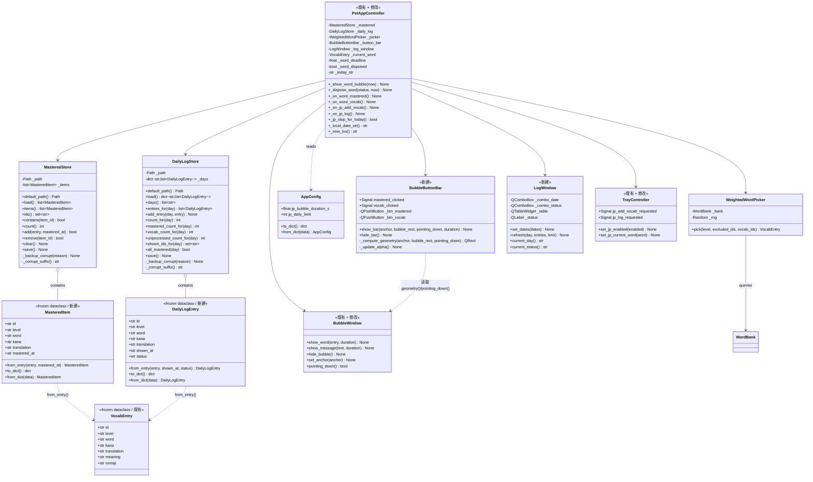
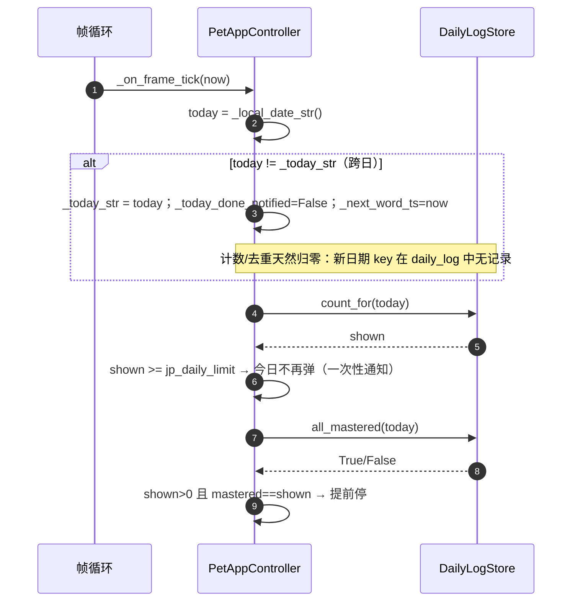
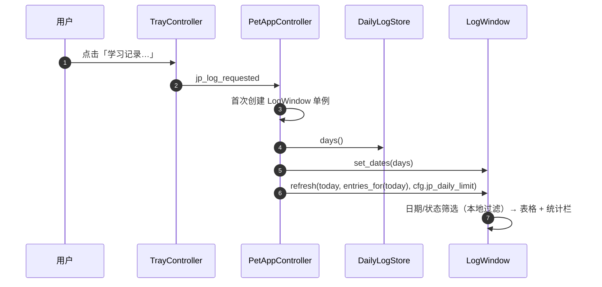
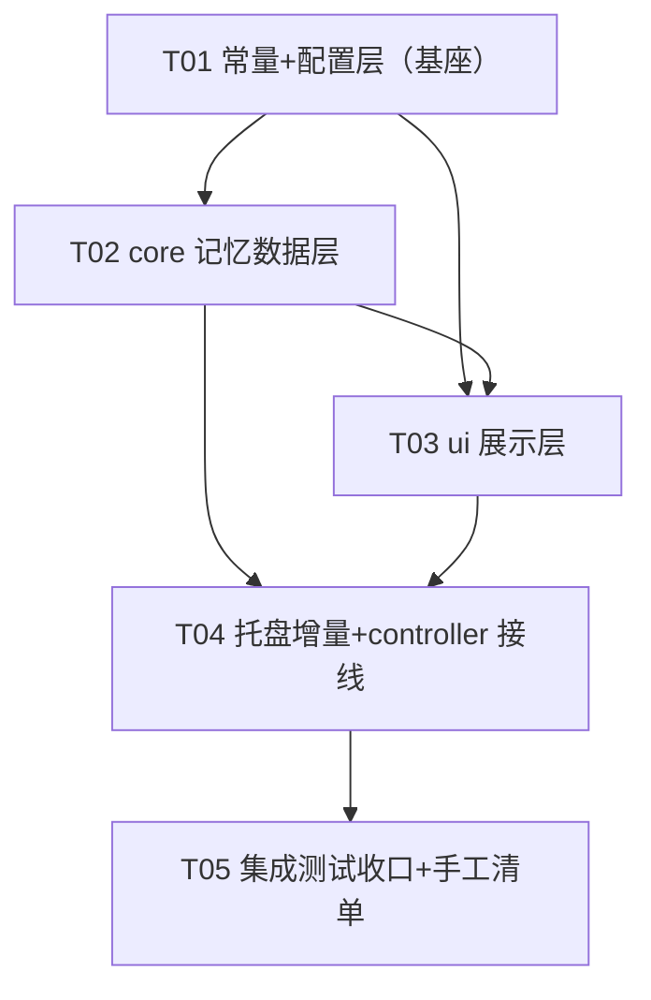

# 桌面宠物「日语记忆」增量架构设计 + 任务分解

> 角色：架构师（高见远）　|　上游 PRD：`docs/prd-japanese-memory.md`
> 增量基础：已实现的 JP-01~JP-16（`core/vocabulary.py` / `core/vocab_store.py` / `ui/bubble.py` / `ui/tray.py` / `app/controller.py`）
> 本文档是**工程师照写代码的施工图**，不含任何源码改动。分层红线：`app → ui → core` 严格单向；`core/` 零 Qt、零 `time`/`datetime`；常量唯一来源 `core/constants.py`。

---

## 1. 实现方案 + 框架选型

### 1.1 一句话策略

在 `core/` 新增三个纯逻辑模块（已掌握集合 `mastered_store`、每日记录 `daily_log_store`、加权抽取器 `weighted_picker`），在 `ui/` 新增一个**常驻可交互**的按钮条浮层 `bubble_button_bar` 与一个只读回查窗口 `log_window`，最后在 `app/controller.py` 用一个**「当前展示词 + deadline + 已处置标志」单飞状态机**把「展示 → 标记 → 停止判定 → 跨日重置 → 回查」串起来。不引入任何新依赖，不改 `BASE_W/BASE_H`，情绪气泡路径语义等价（仅在「学习词展示期间」抑制情绪气泡，见 §1.4）。

### 1.2 框架选型（结论：零新增依赖）

| 层 | 选型 | 说明 |
| --- | --- | --- |
| GUI | 沿用 PySide6 6.9.3（`QWidget`/`QPushButton`/`QTableWidget`/`QComboBox`/`QSystemTrayIcon`） | 按钮条、回查窗口、托盘增量全部复用既有控件 |
| 数据 | 沿用标准库 `json`/`dataclasses`/`pathlib`/`tempfile`/`os` | 两个新 store 与 `VocabStore` 同构，刻意复制范式 |
| 抽取 | 标准库 `random.Random`（注入） | `WeightedWordPicker` 纯逻辑、可注入 rng 复现测试 |
| 时间 | `datetime` **仅在 app 层**使用；`time.monotonic()` 仅 app 层 | `core/` 依旧零 `time`/`datetime`，日期字符串由 app 注入 |

### 1.3 分层改动一览

| 层次 | 新建 | 修改 |
| --- | --- | --- |
| `core/` | `mastered_store.py`、`daily_log_store.py`、`weighted_picker.py` | `constants.py`（新增常量/配色/文案）、`config.py`（新增 2 配置项） |
| `ui/` | `bubble_button_bar.py`、`log_window.py` | `bubble.py`（`show_word` 时长解钳 + `pointing_down()` 访问器 + 渐变高光）、`tray.py`（文案改名 + 学习记录入口 + 信号） |
| `app/` | — | `controller.py`（记忆闭环装配 + 三态处置状态机） |
| 打包 | —（`mastered.json`/`daily_log.json` 是运行期用户数据，在 `%APPDATA%` 下，**不是**随包资源，无需改 spec/pyproject） | — |
| 测试 | `test_mastered_store.py`、`test_daily_log_store.py`、`test_weighted_picker.py`、`test_jp_memory_ui.py` | `test_static_constraints.py`、`test_config.py`、`test_jp_ui.py` |

**不改**：`ui/pet_window.py`、`ui/pet_renderer.py`、`core/pet_model.py`、`core/motion.py`、`core/mood_state_machine.py`、`core/event_aggregator.py`、`core/vocabulary.py`（`WordSampler` 保留但不用于学习主流程）、`main.py`。

### 1.4 四个关键难点的明确方案

#### 难点 1：超时「未处理」与按钮点击的竞态（核心）

**结论：controller 维护「当前展示词 + deadline + 已处置标志」单飞状态机，所有处置都在 Qt 主线程内串行执行，先到先得、后到即 no-op。**

- 展示时：`_current_word = entry`；`_word_deadline = now + jp_bubble_duration_s`；`_word_disposed = False`。
- 帧循环超时分支：`if _current_word and not _word_disposed and now >= _word_deadline: _dispose_word("unprocessed", now)`。
- 按钮点击槽（`mastered`/`vocab`）：进入 `_dispose_word(status, now)`，**第一行**即 `if self._word_disposed: return`，然后 `self._word_disposed = True`，再隐藏气泡/按钮条、落库、清状态、排期下一词。
- 由于 Qt 主线程单线程事件循环，帧 tick 与按钮点击槽**天然串行**，不存在并行写；`_word_disposed` 标志让「同一词」的处置**恰好一次**。若超时帧先执行 → 记未处理 → 随后到来的点击发现 `disposed=True` 被丢弃；若点击先执行 → 记已掌握/生词 → 超时分支发现 `disposed=True` 跳过。**一次展示只落入一种终态，三态互斥成立。**

#### 难点 2：气泡按钮条的生命周期 + 点击穿透

**结论：按钮条是「独立的常驻可交互窗口」，文字区气泡保持 `WindowTransparentForInput` 透传，二者永不运行时切换穿透标志（规避本项目踩过的 Windows 平台「`WindowTransparentForInput` 单比特切换 + show 后需 repaint」坑）。**

- `BubbleButtonBar` 窗口标志：`FramelessWindowHint | WindowStaysOnTopHint | Tool` + `WA_TranslucentBackground | WA_ShowWithoutActivating`，**不设** `WindowTransparentForInput`、**不设** `WA_TransparentForMouseEvents`，按钮 `setFocusPolicy(Qt.NoFocus)`。它从构造起就始终可交互。
- 文字区 `BubbleWindow` 保持现状（透传、零交互）。
- 生命周期由 controller 统一驱动：`show_word(...)` 后紧接 `button_bar.show_bar(...)`；`_dispose_word(...)` 内 `hide_bubble()` + `hide_bar()`。按钮条用与气泡**相同**的淡入/停留/淡出相位常量与 `16ms` tick，视觉同步。

#### 难点 3：`core/` 零 `time`/`datetime`，而 DailyLogStore 需要「当日日期字符串」

**结论：日期字符串由 app 层注入，core 只做纯数据读写与按日期分桶。**

- `DailyLogStore` 的每个方法都显式接收 `day: str`（形如 `"YYYY-MM-DD"`），内部把它当**普通字符串 key**，绝不解析、绝不自取时钟。
- controller 新增 `_local_date_str()`（`datetime.now().strftime("%Y-%m-%d")`，本地自然日），每次帧循环对比 `_today_str`，变化即触发跨日重置。`shown_at`/`mastered_at`/`added_at` 仍由 `_now_iso()`（UTC ISO8601）生成后注入。
- 边界清晰：**「哪一天」由 app 用本地钟决定；「落在哪一天的数据」由 core 按传入 key 分桶。**

#### 难点 4：既有 `show_word` 的 `[2,4]s` 钳制与「默认 30s」冲突

**结论：只解钳 `show_word`（学习泡泡），`show_message`（情绪泡泡）保持 `[2,4]s` 不动。**

- `show_word` 的钳制改为 `min(JP_BUBBLE_MAX_DURATION_S, max(JP_BUBBLE_MIN_DURATION_S, float(duration)))`，其中 `JP_BUBBLE_MIN_DURATION_S=2.0`、`JP_BUBBLE_MAX_DURATION_S=300.0`。controller 传入 `cfg.jp_bubble_duration_s`（默认 30）。
- 相位机 `_update_alpha` 无需改动：HOLD 阶段 `elapsed >= FADE_IN + duration` 自然覆盖 30s。
- 现有 `test_jp_ui.py` 中 `show_word` 的测试只断言 mode/行数/宽度，**不断言时长钳制**，故解钳不破坏现有测试。

### 1.5 学习词与情绪气泡的互斥（必要性说明）

`BubbleWindow` 是单实例；学习词现在停留长达 30s，若期间情绪气泡（点击/表情迁移）覆盖它，会破坏「展示 → 标记」闭环。因此：
- `_show_bubble_for`（情绪）新增守卫：`if self._current_word is not None: return`（学习词展示期间抑制情绪气泡）。
- `_show_word_bubble` 新增守卫：`if self._current_word is not None: return`（已有词在展示时不重复抽取）。

---

## 2. 新增 / 修改文件清单

| 相对路径（项目根） | 新建/修改 | 职责（一句话） |
| --- | --- | --- |
| `src/desktop_pet/core/mastered_store.py` | **新建** | `MasteredItem` + `MasteredStore`（已掌握集合，原子写+容错读+损坏备份，按 id 去重） |
| `src/desktop_pet/core/daily_log_store.py` | **新建** | `DailyLogEntry` + `DailyLogStore`（每日记录，按本地日期分桶 + 查询统计接口） |
| `src/desktop_pet/core/weighted_picker.py` | **新建** | `WeightedWordPicker`（排除已掌握/当日已显示后的加权随机抽取） |
| `src/desktop_pet/core/constants.py` | 修改 | 新增 `JP_*`/`JP_BUTTON_*`/`MASTERED_*`/`DAILY_LOG_*` 常量 + `COLORS` 新键 + 托盘/记录文案 |
| `src/desktop_pet/core/config.py` | 修改 | `AppConfig` 增 `jp_bubble_duration_s`/`jp_daily_limit` + 两个 coercer |
| `src/desktop_pet/ui/bubble_button_bar.py` | **新建** | 常驻可交互按钮条浮层（记住了/新单词），随气泡淡入淡出 |
| `src/desktop_pet/ui/log_window.py` | **新建** | 只读学习记录窗口（日期+状态筛选 + 表格 + 统计栏） |
| `src/desktop_pet/ui/bubble.py` | 修改 | `show_word` 时长解钳；新增 `pointing_down()` 访问器；学习泡泡渐变高光 |
| `src/desktop_pet/ui/tray.py` | 修改 | 「记住当前单词」→「加入生词本」；新增「学习记录…」；信号改名/新增 |
| `src/desktop_pet/app/controller.py` | 修改 | 装配 mastered/daily_log/picker/按钮条/记录窗口；三态处置状态机；停止判定；跨日；超时；托盘槽 |
| `tests/test_mastered_store.py` | **新建** | 已掌握集合单测（去重/原子写/损坏备份/逐字段容错） |
| `tests/test_daily_log_store.py` | **新建** | 每日记录单测（分桶/统计/损坏备份/状态校验） |
| `tests/test_weighted_picker.py` | **新建** | 加权抽取单测（排除/权重/空池） |
| `tests/test_jp_memory_ui.py` | **新建** | 按钮条 + 记录窗口 + 气泡时长/访问器冒烟 |
| `tests/test_static_constraints.py` | 修改 | `COLORS` 精确相等期望同步；`test_core_imports_without_loading_qt` 纳入 3 个新 core 模块；`test_constants_match_prd` 增新常量断言 |
| `tests/test_config.py` | 修改 | 新增 2 配置项容错用例 |
| `tests/test_jp_ui.py` | 修改 | 托盘信号/文案改名同步 |

---

## 3. 数据模型与接口（类图）



### 3.1 关键签名与实现约定（工程师照写）

#### `core/mastered_store.py`（新建，零 Qt，零 time）

```python
@dataclass(frozen=True)
class MasteredItem:
    id: str; level: str; word: str; kana: str; translation: str; mastered_at: str
    @classmethod
    def from_entry(cls, entry: VocabEntry, mastered_at: str) -> "MasteredItem": ...
    def to_dict(self) -> dict[str, Any]: ...
    @classmethod
    def from_dict(cls, data: Any) -> "MasteredItem | None":  # 逐字段容错，任一必填非法 → None

class MasteredStore:
    def __init__(self, path: Path) -> None: ...
    @staticmethod
    def default_path() -> Path:            # %APPDATA%/desktop-pet/mastered.json（APPDATA 缺失回落 Path.home()）
    def load(self) -> list[MasteredItem]:  # 缺失/空→空表；结构损坏→备份 *.corrupt-<ts> 后空表；逐条跳过
    def items(self) -> list[MasteredItem]: ...
    def ids(self) -> set[str]:             # 供排除用
    def contains(self, item_id: str) -> bool: ...
    def count(self) -> int: ...
    def add(self, entry: VocabEntry, mastered_at: str) -> bool:   # 按 id 去重
    def remove(self, item_id: str) -> bool:  # P2 撤销误标（廉价，一并提供）
    def clear(self) -> None: ...
    def save(self) -> None:                # mkstemp + fsync + os.replace 原子写；失败仅 warning
```

> 范式与 `VocabStore` 完全同构（**复制，不抽取共享工具**，避免触碰既有测试）。

#### `core/daily_log_store.py`（新建，零 Qt，零 time）

```python
@dataclass(frozen=True)
class DailyLogEntry:
    id: str; level: str; word: str; kana: str; translation: str; shown_at: str; status: str
    @classmethod
    def from_entry(cls, entry: VocabEntry, shown_at: str, status: str) -> "DailyLogEntry": ...
    def to_dict(self) -> dict[str, Any]: ...
    @classmethod
    def from_dict(cls, data: Any) -> "DailyLogEntry | None":
        # 逐字段容错；status 必须 ∈ C.DAILY_LOG_STATUSES，否则 None（该条跳过）

class DailyLogStore:
    def __init__(self, path: Path) -> None: ...
    @staticmethod
    def default_path() -> Path:            # %APPDATA%/desktop-pet/daily_log.json
    def load(self) -> dict[str, list[DailyLogEntry]]: ...
    def days(self) -> list[str]:           # 降序（最新在前），供回查下拉
    def entries_for(self, day: str) -> list[DailyLogEntry]: ...  # 按插入顺序
    def add_entry(self, day: str, entry: DailyLogEntry) -> None: # append 到桶 + save()
    def count_for(self, day: str) -> int: ...
    def mastered_count_for(self, day: str) -> int: ...
    def vocab_count_for(self, day: str) -> int: ...
    def unprocessed_count_for(self, day: str) -> int: ...
    def shown_ids_for(self, day: str) -> set[str]: ...
    def all_mastered(self, day: str) -> bool:   # shown > 0 且 mastered == shown
    def save(self) -> None: ...
```

> JSON 结构：`{"version":1, "days": {"YYYY-MM-DD": [DailyLogEntry...]}}`。`day` 是注入的字符串 key，core 不解析日期。

#### `core/weighted_picker.py`（新建，零 Qt，零 time）

```python
class WeightedWordPicker:
    def __init__(self, bank: WordBank, rng: random.Random | None = None) -> None: ...
    def pick(self, level: str, excluded_ids: set[str], vocab_ids: set[str]) -> "VocabEntry | None":
        # pool = bank.entries_for(level) 且 id ∉ excluded_ids
        # 权重：id ∈ vocab_ids → C.JP_VOCAB_WEIGHT；否则 1.0
        # random.Random.choices(pool, weights=...) 抽取 1 个；空池返回 None
```

> 无状态：排除集/生词集由 controller 每次传入，跨日/跨等级自然由调用方决定，测试极简。

#### `core/config.py`（修改）

```python
# AppConfig 增：
jp_bubble_duration_s: float = C.JP_BUBBLE_DURATION_S   # 30.0
jp_daily_limit: int = C.JP_DAILY_LIMIT                 # 15

# to_dict/from_dict 增两键；新增：
def _coerce_duration(value: Any, default: float) -> float:   # float，钳制 [JP_BUBBLE_MIN_DURATION_S, JP_BUBBLE_MAX_DURATION_S]
def _coerce_daily_limit(value: Any, default: int) -> int:    # int，钳制 [1, JP_DAILY_LIMIT_MAX]；bool 视为非法
```

> `CONFIG_VERSION` 保持 1（逐字段容错，向后兼容，不升版本）。

#### `ui/bubble.py`（修改，仅 3 处）

```python
def show_word(self, entry, duration: float) -> None:
    # 原：min(BUBBLE_MAX, max(BUBBLE_MIN, duration))  → 改为
    self._duration = min(C.JP_BUBBLE_MAX_DURATION_S, max(C.JP_BUBBLE_MIN_DURATION_S, float(duration)))

def pointing_down(self) -> bool:   # 新增公开访问器：return self._pointing_down
# paintEvent 的 _MODE_WORD 分支：body 顶部叠加一层 bubble_gradient_hi 的浅高光（可选，见 §7）
```

#### `ui/bubble_button_bar.py`（新建）

```python
class BubbleButtonBar(QWidget):
    mastered_clicked = Signal()
    vocab_clicked = Signal()
    def __init__(self) -> None:
        # 窗口标志：Frameless | WindowStaysOnTop | Tool
        # WA_TranslucentBackground | WA_ShowWithoutActivating
        # 不设 WindowTransparentForInput / WA_TransparentForMouseEvents（常驻可交互）
    def show_bar(self, anchor: QPoint, bubble_rect: QRect, pointing_down: bool, duration: float) -> None:
        # 计算几何→show+raise→淡入(0.2s)→hold(duration)→淡出(0.3s)→自隐藏（相位常量与 bubble 一致）
    def hide_bar(self) -> None:   # 立即隐藏（controller 在 dispose 时调用）
    # 内部：两个 QPushButton（记住/新单词），QSS 胶囊样式（圆角/悬停/按下，色值取自 C.COLORS/C.JP_BUTTON_*）
    # QTimer(16ms) 镜像气泡的 _update_alpha 相位机
```

**几何约定（精确）**：
- `cx = anchor.x()`，按钮条水平居中于 `cx`。
- `pointing_down=True`（气泡在宠物上方、尾巴朝下）：`bar_top = bubble_rect.bottom() + JP_BUTTON_BAR_GAP_PX`。
- `pointing_down=False`（气泡翻转到下方、尾巴朝上）：`bar_bottom = bubble_rect.top() - JP_BUTTON_BAR_GAP_PX`。
- 水平/垂直均做屏幕钳制（复用气泡 `_compute_geometry` 的 `availableGeometry` 思路）。

#### `ui/log_window.py`（新建）

```python
class LogWindow(QWidget):
    def __init__(self, parent: QWidget | None = None) -> None:
        # 普通顶层窗口；标题 C.JP_LOG_WINDOW_TITLE；resize(C.JP_LOG_WINDOW_W, C.JP_LOG_WINDOW_H)
    def set_dates(self, dates: list[str]) -> None:        # 填充日期下拉（controller 喂）
    def refresh(self, day: str, entries: list[DailyLogEntry], limit: int) -> None:
        # 按当前状态筛选本地过滤；表格列：单词/假名/翻译/展示时间/状态；状态用颜色标签
        # 状态栏：当日 {shown}/{limit} 条 · 已掌握 m · 生词 v · 未处理 u
    def current_day(self) -> str: ...
    def current_status(self) -> str: ...                   # "全部"/mastered/vocab/unprocessed
    # 内部信号：日期/状态筛选 change → 本地 _apply_filter（纯展示，不读写存储）
```

#### `ui/tray.py`（修改）

```python
jp_add_vocab_requested = Signal()   # 原 jp_remember_requested 改名
jp_log_requested = Signal()         # 新增
# _action_jp_remember → _action_jp_add_vocab（文案 C.JP_MENU_ADD_VOCAB / _TEMPLATE）
# 新增 _action_jp_log（文案 C.JP_MENU_LOG）
# set_jp_enabled：难度 + 加入生词本 置灰/启用；生词本 + 学习记录 始终可用
# set_jp_current_word(word)：更新「加入生词本「{word}」」文案（沿用现有逻辑）
```

#### `app/controller.py`（修改）

新增成员：
```python
self._mastered: MasteredStore = MasteredStore(MasteredStore.default_path())
self._daily_log: DailyLogStore = DailyLogStore(DailyLogStore.default_path())
self._picker: WeightedWordPicker = WeightedWordPicker(self._bank, self._rng)
self._button_bar: BubbleButtonBar = BubbleButtonBar()
self._log_window: LogWindow | None = None
self._word_deadline: float = float("inf")
self._word_disposed: bool = True
self._today_str: str = ""
self._today_done_notified: bool = False
self._level_done_notified: bool = False
```
（`self._sampler` 不再用于学习主流程，可在装配处移除或保留闲置，`WordSampler` 类保留不动。）

新增/修改方法：
```python
def _local_date_str(self) -> str:            # datetime.now().strftime("%Y-%m-%d")，仅 app 层
def _jp_stop_for_today(self) -> bool:        # count_for(today)>=limit 或 daily_log.all_mastered(today)
def _dispose_word(self, status: str, now: float) -> None:
    # 1) if self._word_disposed: return
    # 2) self._word_disposed = True
    # 3) self._bubble.hide_bubble(); self._button_bar.hide_bar()
    # 4) if status=="mastered": _mastered.add(entry, _now_iso()) + _daily_log.add_entry(today, ..., "mastered")
    #    elif status=="vocab": _vocab.add(entry, _now_iso()) + _daily_log.add_entry(today, ..., "vocab")
    #    elif status=="unprocessed": _daily_log.add_entry(today, ..., "unprocessed")
    # 5) 通知（mastered/vocab；unprocessed 静默）
    # 6) _current_word=None; _word_deadline=inf; _tray.set_jp_current_word(None)
    # 7) _schedule_next_word(now)
def _on_word_mastered(self): self._dispose_word(C.DAILY_LOG_STATUS_MASTERED, time.monotonic())
def _on_word_vocab(self):   self._dispose_word(C.DAILY_LOG_STATUS_VOCAB, time.monotonic())
def _on_jp_add_vocab(self): self._dispose_word(C.DAILY_LOG_STATUS_VOCAB, time.monotonic())  # 托盘=气泡「新单词」
def _on_jp_log(self):        # 单例 LogWindow；喂 dates/entries/limit；show+raise
```

`_show_word_bubble(now)` 重写要点：
```python
# 守卫：bubble 关闭 / 睡眠 / 最小间隔 / _current_word 已存在 → return
# 停止判定：_jp_stop_for_today() → 一次性通知「今日学习完成」+ return
# excluded = _mastered.ids() | _daily_log.shown_ids_for(_today_str)
# vocab_ids = {i.id for i in _vocab.items()}
# entry = _picker.pick(cfg.jp_level, excluded, vocab_ids)
# entry None 且 词库非空 → 通知「该等级单词已全部掌握」（once）+ return
# 置 _current_word/_word_deadline/_word_disposed=False；tray 更新当前词
# _bubble.show_word(entry, cfg.jp_bubble_duration_s)
# _button_bar.show_bar(_bubble_anchor(), _bubble.geometry(), _bubble.pointing_down(), cfg.jp_bubble_duration_s)
```

`_on_frame_tick(now)` 增量：
```python
# ① 跨日：today = _local_date_str(); if today != _today_str: _today_str=today; _today_done_notified=False; _next_word_ts=now
# ② 超时：if _current_word and not _word_disposed and now >= _word_deadline: _dispose_word("unprocessed", now)
# ③ 原有「学习模式到点展示」分支改为受 _current_word 守卫
```

`_show_bubble_for` 增量：`if self._current_word is not None: return`。

---

## 4. 程序调用流程（时序图）

### 4.1 展示：到点 → 停止判定 → 加权抽取 → 气泡 + 按钮条

```mermaid
sequenceDiagram
    autonumber
    participant FL as 帧循环
    participant CT as PetAppController
    participant DL as DailyLogStore
    participant WP as WeightedWordPicker
    participant BW as BubbleWindow
    participant BB as BubbleButtonBar

    FL->>CT: _on_frame_tick(now)
    CT->>CT: 跨日检测（today != _today_str → 更新并 _next_word_ts=now）
    CT->>CT: 超时检测（_current_word 且 now>=_word_deadline → dispose unprocessed）
    alt now < _next_word_ts 或 未开启 或 _current_word 已存在
        CT-->>FL: return
    end
    CT->>CT: _show_word_bubble(now)
    CT->>DL: count_for(today) / mastered_count_for(today)
    DL-->>CT: shown, mastered
    CT->>CT: 停止判定（shown>=limit 或 all_mastered）→ 通知+return
    CT->>DL: shown_ids_for(today)
    CT->>WP: pick(level, excluded=mastered∪shown, vocab_ids)
    WP-->>CT: entry 或 None
    alt None → 通知该等级已全部掌握
    else 有效
        CT->>CT: _current_word=entry; _word_deadline=now+duration; _word_disposed=False
        CT->>BW: show_word(entry, duration)
        CT->>BB: show_bar(anchor, bubble.geometry(), pointing_down, duration)
    end
```

### 4.2 点击「记住了 / 新单词」→ 单飞处置 → 落库 → 排期

```mermaid
sequenceDiagram
    autonumber
    participant U as 用户
    participant BB as BubbleButtonBar
    participant CT as PetAppController
    participant MS as MasteredStore
    participant VS as VocabStore
    participant DL as DailyLogStore
    participant BW as BubbleWindow

    U->>BB: 点击「记住了」
    BB->>CT: mastered_clicked
    CT->>CT: _dispose_word("mastered", now)
    CT->>CT: guard _word_disposed → return（单飞）
    CT->>CT: _word_disposed = True
    CT->>BW: hide_bubble()
    CT->>BB: hide_bar()
    CT->>MS: add(entry, mastered_at=_now_iso())
    CT->>DL: add_entry(today, DailyLogEntry(..., "mastered"))
    CT->>CT: _current_word=None; _word_deadline=inf; 通知; _schedule_next_word(now)
```

### 4.3 超时 → 未处理（与点击互斥，见 §1.4 难点 1）

```mermaid
sequenceDiagram
    autonumber
    participant FL as 帧循环
    participant CT as PetAppController
    participant DL as DailyLogStore
    participant BB as BubbleButtonBar
    participant BW as BubbleWindow

    FL->>CT: _on_frame_tick(now)
    CT->>CT: if _current_word 且 not _word_disposed 且 now>=_word_deadline
    CT->>CT: _dispose_word("unprocessed", now)
    CT->>BB: hide_bar()
    CT->>DL: add_entry(today, DailyLogEntry(..., "unprocessed"))
    CT->>CT: _current_word=None; _schedule_next_word(now)
    Note over BW: 气泡自身按 duration 淡出（controller 不再重复落库）
```

### 4.4 停止判定 + 跨日重置



### 4.5 回查：打开学习记录窗口



---

## 5. 任务列表（按实现顺序，5 个任务）

> 规则：每任务 ≥3 文件；禁止 `print`；`core` 零 Qt 零 time；常量唯一来源 `constants.py`；用户数据损坏「备份不静默清空」。

| 任务 ID | 任务名称 | 依赖 | 优先级 |
| --- | --- | --- | --- |
| T01 | 常量 + 配置层（基座） | — | P0 |
| T02 | core 记忆数据层（三个纯逻辑模块） | T01 | P0 |
| T03 | ui 展示层（按钮条 + 记录窗口 + 气泡质感） | T01, T02 | P0 |
| T04 | 托盘增量 + controller 记忆闭环接线 | T01, T02, T03 | P0 |
| T05 | 集成测试收口 + 手工验收清单 | T01, T02, T03, T04 | P0 |

### T01 常量 + 配置层（基座）

**文件**：`core/constants.py`（改）、`core/config.py`（改）、`tests/test_static_constraints.py`（改）、`tests/test_config.py`（改）

**做什么**：
- `constants.py` 新增：时长/上限 `JP_BUBBLE_DURATION_S=30.0`、`JP_BUBBLE_MIN_DURATION_S=2.0`、`JP_BUBBLE_MAX_DURATION_S=300.0`、`JP_DAILY_LIMIT=15`、`JP_DAILY_LIMIT_MAX=200`、`JP_VOCAB_WEIGHT=3.0`；文件/版本 `MASTERED_FILE_NAME/VERSION`、`DAILY_LOG_FILE_NAME/VERSION`；状态 `DAILY_LOG_STATUS_MASTERED/VOCAB/UNPROCESSED`、`DAILY_LOG_STATUSES`；按钮条 `JP_BUTTON_MASTERED/VOCAB/RADIUS/PAD_X/PAD_Y/BAR_GAP_PX/BAR_PAD/FONT_SIZE`；托盘 `JP_MENU_ADD_VOCAB`、`JP_MENU_ADD_VOCAB_TEMPLATE`、`JP_MENU_LOG`；通知 `JP_NOTIFY_MASTERED_ADDED/MASTERED_DUPLICATE/LEVEL_DONE/TODAY_DONE`；记录窗口 `JP_LOG_*` 全套文案/尺寸；`COLORS` 新键（见 §7.3）。
- `config.py`：`AppConfig` 增 `jp_bubble_duration_s`/`jp_daily_limit`；新增 `_coerce_duration`/`_coerce_daily_limit`；`to_dict/from_dict` 同步。
- `test_static_constraints.py`：`test_color_palette_matches_prd` 期望字典同步新键；`test_constants_match_prd` 增 `JP_BUBBLE_DURATION_S=30.0`、`JP_DAILY_LIMIT=15`、`JP_VOCAB_WEIGHT=3.0`。
- `test_config.py`：旧配置缺两键回落默认；非法时长/上限回落默认；`CONFIG_VERSION` 仍为 1。

**验收点**：`constants.py` 可导入；`BASE_W/BASE_H` 未变；`CONFIG_VERSION==1`；旧配置缺键不抛且回落默认；`test_color_palette_matches_prd` 恢复通过。

### T02 core 记忆数据层（三个纯逻辑模块）

**文件**：`core/mastered_store.py`（新）、`core/daily_log_store.py`（新）、`core/weighted_picker.py`（新）、`tests/test_mastered_store.py`（新）、`tests/test_daily_log_store.py`（新）、`tests/test_weighted_picker.py`（新）、`tests/test_static_constraints.py`（改）

**做什么**：
- `mastered_store.py`：`MasteredItem` + `MasteredStore`，范式复制 `VocabStore`（原子写 + 逐字段容错 + 损坏备份 `*.corrupt-*`），`ids()`/`add` 按 id 去重。
- `daily_log_store.py`：`DailyLogEntry`（status 校验）+ `DailyLogStore`（`days` 分桶 + 统计接口 + 损坏备份），`day` 为注入字符串 key。
- `weighted_picker.py`：`WeightedWordPicker.pick(level, excluded_ids, vocab_ids)`，加权随机、空池 None。
- `test_static_constraints.py`：`test_core_imports_without_loading_qt` 的导入清单加入 `mastered_store`/`daily_log_store`/`weighted_picker` 三个模块。

**验收点**：`core` 三个新模块零 Qt、零 `time`/`datetime`；损坏 JSON 被备份为 `.corrupt-*` 且不静默清空；`all_mastered` 满足 `shown>0 且 mastered==shown`；加权抽取权重 3:1 生效（用注入 rng 复现）；空池返回 None。

### T03 ui 展示层（按钮条 + 记录窗口 + 气泡质感）

**文件**：`ui/bubble_button_bar.py`（新）、`ui/log_window.py`（新）、`ui/bubble.py`（改）、`tests/test_jp_memory_ui.py`（新）、`tests/test_jp_ui.py`（改）

**做什么**：
- `bubble_button_bar.py`：常驻可交互浮层，两个胶囊按钮，`mastered_clicked`/`vocab_clicked` 信号，`show_bar`/`hide_bar`，镜像气泡淡入淡出相位机，几何按 §3.1 对齐。
- `log_window.py`：只读记录窗口（日期下拉 + 状态筛选 + 表格 + 统计栏），`set_dates`/`refresh`/`current_day`/`current_status`。
- `bubble.py`：`show_word` 时长解钳；新增 `pointing_down()`；`_MODE_WORD` body 顶部浅高光。
- `test_jp_memory_ui.py`：按钮条信号/几何/交互属性（不设穿透标志）、记录窗口筛选/统计、气泡时长/访问器冒烟。
- `test_jp_ui.py`：气泡相关用例若因 `show_word` 解钳受影响则同步。

**验收点**：按钮条**不含** `WindowTransparentForInput`/`WA_TransparentForMouseEvents`；点按钮发对应信号；`show_word(entry, 30)` 后 `_duration==30`（不再被钳到 4）；`pointing_down()` 返回正确翻转态；记录窗口状态筛选与统计栏正确；`qtbot` 冒烟不弹真实窗口。

### T04 托盘增量 + controller 记忆闭环接线

**文件**：`ui/tray.py`（改）、`app/controller.py`（改）、`tests/test_jp_ui.py`（改）

**做什么**：
- `tray.py`：`jp_remember_requested`→`jp_add_vocab_requested`；新增 `jp_log_requested` + `_action_jp_log`；文案 `JP_MENU_ADD_VOCAB`；`set_jp_enabled` 保持「生词本 + 学习记录」始终可用。
- `controller.py`：装配 `MasteredStore/DailyLogStore/WeightedWordPicker/BubbleButtonBar/LogWindow`；实现 `_dispose_word` 单飞状态机、`_show_word_bubble` 重写、`_on_word_mastered/_on_word_vocab/_on_jp_add_vocab/_on_jp_log`、`_jp_stop_for_today/_local_date_str`、`_on_frame_tick` 跨日+超时、`_show_bubble_for` 学习词互斥守卫、`_load_japanese` 加载两个新 store。
- `test_jp_ui.py`：托盘信号改名、`_action_jp_log` 存在、`set_jp_enabled` 置灰断言同步。

**验收点**：点「记住了」→ 进 mastered + 当日记录 mastered + 立即关气泡/按钮条 + 下次抽取永久排除；点「新单词」/托盘「加入生词本」→ 进 vocab + 当日记录 vocab + 加权 3.0；超时 → 仅 daily_log unprocessed；同词同帧点击与超时**只落一种终态**；`shown>=limit` 或 `all_mastered` 后今日不再弹；跨日自动恢复；学习词展示期间情绪气泡被抑制。

### T05 集成测试收口 + 手工验收清单

**文件**：`tests/test_jp_memory_ui.py`（补 controller 级冒烟）、`tests/test_static_constraints.py`（最终核对）、`tests/manual_checklist.md`（改）、`README.md`（改，可选）

**做什么**：
- 补齐 controller 级无头冒烟（注入 now 序列，验证 30s 超时、每日上限、全部记住提前停、跨日恢复；store 用 `tmp_path`）。
- 最终跑 `pytest -q`，确认既有 286 用例 + 新增用例全绿（仅 COLORS/常量/tray 文案期望为**有意的**同步修改）。
- `manual_checklist.md` 增「日语记忆闭环」手工验收项（按钮可点、点击穿透仅文字区、30s 超时、跨日、回查）。
- `README.md`（可选）补一句记忆闭环说明。

**验收点**：全量测试绿；手工清单覆盖三态与竞态；无新增依赖；无 `print`；无图片素材。

---

## 6. 依赖包列表

**结论：不引入任何新第三方依赖。**

| 来源 | 用途 |
| --- | --- |
| 标准库 | `json`/`dataclasses`/`pathlib`/`logging`/`os`/`tempfile`（store 原子写+容错）、`random.Random`（加权抽取）、`datetime`（**仅 app** 生成日期与 UTC 时间戳）、`typing` |
| 已有第三方 | `PySide6`（`QWidget/QPushButton/QTableWidget/QComboBox/QSystemTrayIcon`，`ui/` 层） |

---

## 7. 共享知识（跨文件约定）

### 7.1 分层与 import 纪律
- `core/**` 禁止 import `PySide6.*`；禁止反向 import `ui`/`app`；禁止 `time`/`datetime`。记忆/抽取/记录逻辑全部在 `core`。
- `ui` 只发信号、不含业务判定；`app` 负责所有判定与接线。

### 7.2 常量命名前缀规则（新增一律 `core/constants.py`）
| 前缀 | 归属 | 示例 |
| --- | --- | --- |
| `JP_` | 日语学习通用 | `JP_BUBBLE_DURATION_S`、`JP_DAILY_LIMIT`、`JP_VOCAB_WEIGHT` |
| `JP_BUTTON_` | 按钮条专属 | `JP_BUTTON_MASTERED`、`JP_BUTTON_RADIUS`、`JP_BUTTON_BAR_GAP_PX` |
| `JP_MENU_` / `JP_NOTIFY_` | 托盘菜单 / 通知文案 | `JP_MENU_ADD_VOCAB`、`JP_NOTIFY_MASTERED_ADDED` |
| `JP_LOG_` | 学习记录窗口 | `JP_LOG_WINDOW_TITLE`、`JP_LOG_STATUS_TEMPLATE` |
| `MASTERED_` | 已掌握集合文件/版本 | `MASTERED_FILE_NAME`、`MASTERED_VERSION` |
| `DAILY_LOG_` | 每日记录文件/版本/状态 | `DAILY_LOG_FILE_NAME`、`DAILY_LOG_STATUS_MASTERED` |

### 7.3 `COLORS` 新增键（`test_color_palette_matches_prd` **必须**同步）
| 新键 | 建议值 | 用途 |
| --- | --- | --- |
| `bubble_gradient_hi` | `#FFFFFF` | 学习泡泡 body 顶部浅高光（质感） |
| `jp_button_primary_bg` | `#7A9E7E` | 「记住了」主色填充（正向绿） |
| `jp_button_primary_text` | `#FFFFFF` | 「记住了」文字 |
| `jp_button_primary_hover` | `#8FB090` | 主按钮悬停 |
| `jp_button_primary_pressed` | `#6B8E6F` | 主按钮按下 |
| `jp_button_secondary_border` | `#9C8570` | 「新单词」描边 |
| `jp_button_secondary_text` | `#7A5A42` | 「新单词」文字 |
| `jp_button_secondary_hover` | `#F3EAE0` | 次按钮悬停填充 |
| `jp_button_bar_bg` | `#FFFDF8` | 按钮条底色 |
| `log_status_mastered` | `#7A9E7E` | 状态标签·已掌握（绿） |
| `log_status_vocab` | `#5B8DB8` | 状态标签·生词（蓝） |
| `log_status_unprocessed` | `#B7A99A` | 状态标签·未处理（灰） |

### 7.4 store 范式（三条一致）
- **原子写**：`tempfile.mkstemp` 同目录 + `flush/fsync` + `os.replace`，失败仅 `logger.warning`。
- **容错读**：文件缺失/为空 → 空表；JSON 解析失败/根非法 → 备份后空表；逐条非法记录跳过、保留合法记录。
- **损坏备份**：`os.replace` 为 `<name>.corrupt-<mtime整数秒>`（`_corrupt_suffix` 用 `os.stat` 的 mtime，**不 import time**，与 `VocabStore` 同构）。用户数据**绝不静默清空**。

### 7.5 时间注入约定（core 零 time 的具体边界）
- 动画/状态机/超时用 `float` 秒（`time.monotonic()`），由 app 注入。
- `mastered_at`/`shown_at`/`added_at` = **UTC ISO8601**，由 app `_now_iso()` 生成后注入 core。
- 每日分桶 key `day` = **本地自然日** `YYYY-MM-DD`，由 app `_local_date_str()` 生成后注入 `DailyLogStore`；core 只做字符串 key 分桶与统计，不解析日期。
- 跨日判定在 app 层帧循环完成（对比 `_local_date_str()` 与 `_today_str`），core 无任何时钟逻辑。

### 7.6 信号命名与三态取值
- 信号 `snake_case` + `_requested/_clicked` 后缀（`jp_add_vocab_requested`、`mastered_clicked`）。
- 三态唯一取值（字符串）：`"mastered"` / `"vocab"` / `"unprocessed"`，与 `DAILY_LOG_STATUS_*` 常量一致；一次展示**恰好**落一种终态。

### 7.7 日志与文案
- `logger = logging.getLogger(__name__)`，禁止 `print`；文案一律取常量，`str.format(word=..., kana=...)`。

---

## 8. 待明确事项

1. **按钮条与宠物头部可能存在轻微视觉重叠**：按钮条位于气泡尾尖下方、距宠物头顶仅约 `JP_BUTTON_BAR_GAP_PX`，在宠物正上方场景会浮在宠物额头附近。建议 T03 后手工核对观感，必要时调大 `JP_BUTTON_BAR_GAP_PX` 或缩小按钮高度（常量已集中，改一处即可）。若团队认为「气泡下方」应严格贴尾尖而重叠不可接受，需 team-lead 拍板是否改为「按钮条贴在气泡底、把气泡整体上移」。
2. **超时淡出与立即关的取舍**：本设计在超时/dispose 时**立即**隐藏气泡+按钮条（点击=立即关，符合 PRD），未做 0.3s 淡出；气泡自身相位机的淡出仅在「未被子 dispose 抢占」时可见。若要求严格淡出，可后续加 0.3s 延迟隐藏（P2 打磨，不影响正确性）。
3. **学习词展示期间抑制情绪气泡**（§1.5）是必要的正确性守卫，会牺牲「展示单词的 30s 内点击宠物不再弹开心气泡」的即时反馈。若 team-lead 认为不可接受，替代方案是「单词气泡与情绪气泡各用一个 `BubbleWindow` 实例」——成本更高，默认不采纳。
4. **`jp_daily_limit` 含所有终态**：上限约束「展示次数」而非终态（已按 team-lead 决策 6 落实，未处理/生词均计入）。
5. **`WordSampler` 的去留**：保留类与其测试，不再用于学习主流程（避免破坏既有测试）；controller 内原 `_sampler` 成员可移除或闲置，建议移除引用以降低混淆。
6. **`JP_NOTIFY_REMEMBER_ADDED/DUPLICATE` 命名**：文案已正确（「已加入生词本」），仅常量名残留「REMEMBER」。为控制改动面，本设计**保留原名**，仅新增 mastered 通知；如追求命名一致性可另作小重构（非必须）。

---

## 附：任务依赖图


